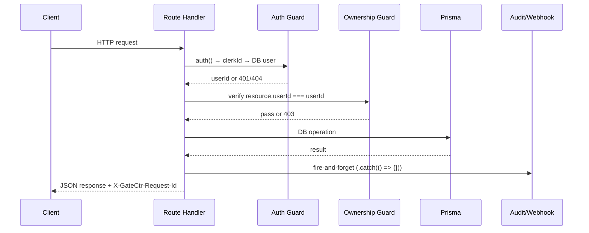

# Design Document: API Logic Completion

## Overview

This document describes the technical design for implementing all missing API route handlers in GateCtr's `app/api/v1/` layer. The feature covers ten requirement groups spanning project management, alert rules, team invitations, project-scoped usage, integration connectors, team member role updates, optimization rules, cache statistics, system health, and cross-cutting auth/error handling.

All routes follow the established pattern from `app/api/v1/projects/route.ts` and `app/api/v1/teams/members/route.ts`:

1. Auth guard: `auth()` → `clerkId` → DB user lookup
2. Ownership guard: verify resource belongs to the authenticated user
3. Business logic
4. Fire-and-forget: `logAudit()` + `dispatchWebhook()` (where applicable)
5. Return response with `X-GateCtr-Request-Id` header

---

## Architecture

### Request Flow



### Auth Guard Pattern (reused verbatim across all protected routes)

```typescript
const { userId: clerkId } = await auth();
if (!clerkId)
  return NextResponse.json({ error: "Unauthorized" }, { status: 401, headers });

const dbUser = await prisma.user.findUnique({
  where: { clerkId },
  select: { id: true },
});
if (!dbUser)
  return NextResponse.json({ error: "User not found" }, { status: 404, headers });
```

### Request ID Helper (reused from `app/api/v1/provider-keys/route.ts`)

```typescript
import { randomBytes } from "crypto";
function requestId(): string {
  return randomBytes(8).toString("hex");
}
// Usage: const rid = requestId(); const headers = { "X-GateCtr-Request-Id": rid };
```

### Encryption Pattern (for IntegrationConnector)

`lib/encryption.ts` exposes `encrypt(plaintext: string): string` using AES-256-GCM. The output format is `iv:authTag:ciphertext` (all hex). Config objects are `JSON.stringify`-ed before encryption and stored in `encryptedConfig`. The raw config is never returned in GET responses.

### Token Generation Pattern (for TeamInvitation)

```typescript
import { randomBytes } from "crypto";
const token = randomBytes(32).toString("hex"); // 64-char hex string
const expiresAt = new Date(Date.now() + 7 * 24 * 60 * 60 * 1000);
```

---

## Components and Interfaces

### File Structure

All new files follow the existing `app/api/v1/` convention:

```
app/api/v1/
├── projects/
│   ├── route.ts                          (existing — GET list, POST create)
│   └── [id]/
│       ├── route.ts                      (NEW — GET, PATCH, DELETE single project)
│       └── usage/
│           └── route.ts                  (NEW — GET project-scoped usage)
├── alerts/
│   ├── route.ts                          (NEW — GET list, POST create, DELETE)
│   └── [id]/
│       └── history/
│           └── route.ts                  (NEW — GET alert history)
├── teams/
│   ├── invitations/
│   │   ├── route.ts                      (NEW — POST create invitation)
│   │   └── [token]/
│   │       ├── route.ts                  (NEW — GET invitation by token, no auth)
│   │       └── accept/
│   │           └── route.ts              (NEW — POST accept invitation)
│   └── members/
│       ├── route.ts                      (existing — POST add, DELETE remove)
│       └── [memberId]/
│           └── role/
│               └── route.ts              (NEW — PATCH update role)
├── integrations/
│   └── route.ts                          (NEW — GET list, POST create, DELETE)
├── optimization-rules/
│   ├── route.ts                          (NEW — GET list, POST create)
│   └── [id]/
│       └── route.ts                      (NEW — PATCH update, DELETE)
├── cache/
│   └── stats/
│       └── route.ts                      (NEW — GET cache statistics)
└── system/
    └── health/
        └── route.ts                      (NEW — GET system health, no auth)
```

### Route Handler Interfaces

#### `GET /api/v1/projects/[id]`
- Input: path param `id`
- Output: `Project` record
- Guards: Auth, Ownership

#### `PATCH /api/v1/projects/[id]`
- Input: `{ name?, description?, color?, isActive? }`
- Output: updated `Project`
- Guards: Auth, Ownership
- Side effects: `logAudit` (resource: "project", action: "updated", oldValue, newValue), `dispatchWebhook` ("project.updated")

#### `DELETE /api/v1/projects/[id]`
- Input: path param `id`
- Output: `{ success: true }`
- Guards: Auth, Ownership
- Side effects: `logAudit` (resource: "project", action: "deleted"), `dispatchWebhook` ("project.deleted")

#### `GET /api/v1/alerts`
- Output: `AlertRule[]` ordered by `createdAt` desc

#### `POST /api/v1/alerts`
- Input: `{ name, alertType, condition, channels?, projectId? }`
- Validation: `alertType` ∈ `{budget_threshold, token_limit, error_rate, latency}`
- Output: created `AlertRule` (201)
- Side effects: `logAudit` (resource: "alert_rule", action: "created")

#### `DELETE /api/v1/alerts`
- Input: body `{ id }`
- Guards: Auth, Ownership (AlertRule.userId === dbUser.id)
- Side effects: `logAudit` (resource: "alert_rule", action: "deleted")

#### `GET /api/v1/alerts/[id]/history`
- Guards: Auth, Ownership (AlertRule.userId === dbUser.id)
- Output: `Alert[]` ordered by `createdAt` desc

#### `POST /api/v1/teams/invitations`
- Input: `{ teamId, email, role }`
- Guards: Auth, team ownership (Team.ownerId === dbUser.id)
- Conflict check: unique `[teamId, email]`
- Output: created `TeamInvitation` (201)

#### `GET /api/v1/teams/invitations/[token]`
- No auth required
- Output: invitation + `team.name`
- 404 if not found or expired

#### `POST /api/v1/teams/invitations/[token]/accept`
- Guards: Auth
- Creates `TeamMember`, sets `acceptedAt`
- Side effects: `logAudit`, `dispatchWebhook` ("team.member.added")

#### `GET /api/v1/projects/[id]/usage`
- Guards: Auth, Ownership
- Query params: `from`, `to` (default: current month)
- Output: aggregated totals + `byDate` + optional `budget` + optional `byModel`

#### `GET /api/v1/integrations`
- Output: `IntegrationConnector[]` with `encryptedConfig` excluded

#### `POST /api/v1/integrations`
- Input: `{ type, name, config }`
- Validation: `type` ∈ `{slack, teams, discord, zapier, custom}`
- Encrypts `config` via `encrypt(JSON.stringify(config))`
- Conflict check: unique `[userId, type, name]`

#### `DELETE /api/v1/integrations`
- Input: body `{ id }`
- Guards: Auth, Ownership

#### `PATCH /api/v1/teams/members/[memberId]/role`
- Input: `{ role }`
- Validation: `role` ∈ `{ADMIN, MEMBER, VIEWER}`
- Guards: Auth, team ownership
- Prevents owner from changing own role

#### `GET /api/v1/optimization-rules`
- Output: `OptimizationRule[]` where `isActive = true`, ordered by `priority` desc

#### `POST /api/v1/optimization-rules`
- Input: `{ name, ruleType, description?, pattern?, replacement?, priority?, isActive? }`
- Validation: `ruleType` ∈ `{compression, rewrite, pruning}`

#### `PATCH /api/v1/optimization-rules/[id]`
- Input: any subset of `{ name, description, pattern, replacement, priority, isActive }`

#### `DELETE /api/v1/optimization-rules/[id]`
- 404 if not found

#### `GET /api/v1/cache/stats`
- Guards: Auth
- Output: `{ totalEntries, totalHits, topModels, estimatedTokensSaved }`

#### `GET /api/v1/system/health`
- No auth required
- Output: `{ status, services: { app, database, redis, queue, stripe } }`

---

## Data Models

All models are defined in `prisma/schema.prisma`. Key relationships for this feature:

```
User ──< Project ──< UsageLog
              └──< Budget
              └──< ApiKey (cascade delete)

User ──< AlertRule ──< Alert

Team ──< TeamInvitation
Team ──< TeamMember >── User

User ──< IntegrationConnector

CacheEntry (no userId — scoped by requestHash)

SystemHealth (no userId — global per service)

OptimizationRule (no userId — global/admin-managed)
```

### Key field notes

- `TeamInvitation.token`: 64-char hex (32 random bytes), unique index exists
- `TeamInvitation.expiresAt`: `now + 7 days`
- `IntegrationConnector.encryptedConfig`: AES-256-GCM encrypted JSON string stored as `Json` column
- `CacheEntry.expiresAt`: filter condition `expiresAt > new Date()` for all cache stats queries
- `SystemHealth.service`: one of `app | database | redis | queue | stripe`

### Cache Stats Query Design

The cache stats endpoint uses three Prisma queries in parallel:

```typescript
const now = new Date();
const where = { expiresAt: { gt: now } };

const [count, hitAgg, topModelsRaw] = await Promise.all([
  prisma.cacheEntry.count({ where }),
  prisma.cacheEntry.aggregate({
    where,
    _sum: { hitCount: true },
  }),
  prisma.cacheEntry.groupBy({
    by: ["model", "provider"],
    where,
    _sum: { hitCount: true, promptTokens: true },
    _count: { id: true },
    orderBy: { _sum: { hitCount: "desc" } },
    take: 10,
  }),
]);

const estimatedTokensSaved = topModelsRaw.reduce(
  (acc, r) => acc + (r._sum.promptTokens ?? 0) * (r._sum.hitCount ?? 0),
  0,
);
```

Note: `CacheEntry` has no `userId` field — cache stats are global (not user-scoped). The auth guard is still applied to prevent unauthenticated access.

### System Health Query Design

Latest-per-service uses `findFirst` with `orderBy: { checkedAt: "desc" }` for each of the five services, run in parallel:

```typescript
const SERVICES = ["app", "database", "redis", "queue", "stripe"] as const;

const results = await Promise.all(
  SERVICES.map((service) =>
    prisma.systemHealth.findFirst({
      where: { service },
      orderBy: { checkedAt: "desc" },
    })
  )
);
```

Overall status computation:
- Any `DOWN` → `"down"`
- Any `DEGRADED` → `"degraded"`
- All `HEALTHY` (or all null) → `"healthy"` (null services return `"unknown"` individually)

### Project Usage Query Design

Reuses the same `DailyUsageCache` + `UsageLog` pattern from `app/api/v1/usage/route.ts`, scoped to `projectId`:

```typescript
const whereBase = { userId: dbUser.id, projectId: id, date: { gte: from, lte: to } };

const [totals, byDateRaw, budget, byModelRaw] = await Promise.all([
  prisma.dailyUsageCache.aggregate({ where: whereBase, _sum: { ... } }),
  prisma.dailyUsageCache.findMany({ where: whereBase, orderBy: { date: "asc" } }),
  prisma.budget.findUnique({ where: { projectId: id } }),
  hasAdvancedAnalytics
    ? prisma.usageLog.groupBy({ by: ["model", "provider"], where: usageLogWhere, ... })
    : Promise.resolve(null),
]);
```

---

## Correctness Properties

*A property is a characteristic or behavior that should hold true across all valid executions of a system — essentially, a formal statement about what the system should do. Properties serve as the bridge between human-readable specifications and machine-verifiable correctness guarantees.*

### Property 1: Ownership guard blocks non-owners

*For any* resource (project, alert rule, integration connector, team) and any user who is not the owner of that resource, any GET/PATCH/DELETE request to the resource-specific endpoint should return a 403 response.

**Validates: Requirements 1.2, 2.6, 4.3, 5.7, 6.2**

---

### Property 2: Input validation rejects invalid enum values and missing fields

*For any* POST or PATCH request where a required enum field (`alertType`, `ruleType`, `type`, `role`) contains a value outside the allowed set, or where a required field (`name`, `condition`, `config`) is absent, the response should be 400 with the appropriate `error` code.

**Validates: Requirements 2.3, 2.4, 5.3, 5.4, 6.3, 7.3**

---

### Property 3: Partial update preserves unmodified fields

*For any* project or optimization rule and any subset of updatable fields, a PATCH request should update exactly the provided fields and leave all other fields unchanged.

**Validates: Requirements 1.3, 7.4**

---

### Property 4: Mutating operations emit audit log entries

*For any* create, update, or delete operation on a project, alert rule, integration connector, team invitation, or team member role, `logAudit` should be called with the correct `resource`, `action`, and (where applicable) `oldValue`/`newValue` fields.

**Validates: Requirements 1.5, 1.6, 2.8, 3.9, 5.8, 6.6**

---

### Property 5: Webhook-triggering operations dispatch the correct event

*For any* project update/delete, team invitation acceptance, or team member role update, `dispatchWebhook` should be called with the correct event name and a payload containing the relevant IDs and values.

**Validates: Requirements 1.7, 3.10, 6.7**

---

### Property 6: All responses include X-GateCtr-Request-Id header

*For any* request to any endpoint in this feature, the response should include an `X-GateCtr-Request-Id` header containing an 8-byte hex string.

**Validates: Requirements 1.8, 9.6, 10.5**

---

### Property 7: Alert rules list is ordered by createdAt descending

*For any* user with N alert rules created at distinct timestamps, the GET `/api/v1/alerts` response should return all N rules in descending `createdAt` order.

**Validates: Requirements 2.1**

---

### Property 8: Team invitation token is unique and expires in 7 days

*For any* valid team invitation creation request, the resulting `TeamInvitation` record should have a non-empty unique token and an `expiresAt` timestamp within ±1 second of `now + 7 days`.

**Validates: Requirements 3.1**

---

### Property 9: Duplicate invitation returns 409

*For any* `(teamId, email)` pair where a `TeamInvitation` already exists, a second POST to `/api/v1/teams/invitations` should return 409 with `error: "invitation_already_exists"`.

**Validates: Requirements 3.3**

---

### Property 10: Invitation fetch by token is a round-trip

*For any* created non-expired invitation, a GET to `/api/v1/teams/invitations/[token]` should return the invitation record including the team name, without requiring authentication.

**Validates: Requirements 3.4**

---

### Property 11: Accepting an invitation creates a TeamMember and sets acceptedAt

*For any* valid unaccepted non-expired invitation, a POST to `/api/v1/teams/invitations/[token]/accept` should create a `TeamMember` record with the invitation's role and set `acceptedAt` to a non-null timestamp.

**Validates: Requirements 3.6**

---

### Property 12: Already-accepted invitation returns 409

*For any* invitation where `acceptedAt` is not null, a POST to accept should return 409 with `error: "invitation_already_accepted"`.

**Validates: Requirements 3.7**

---

### Property 13: Integration GET response never includes encryptedConfig

*For any* user with any number of integration connectors, the GET `/api/v1/integrations` response objects should not contain an `encryptedConfig` field.

**Validates: Requirements 5.1**

---

### Property 14: Integration config encryption round-trip

*For any* config object posted to `/api/v1/integrations`, the value stored in `encryptedConfig` should decrypt (via `decrypt()`) to the original `JSON.stringify`-ed config.

**Validates: Requirements 5.2**

---

### Property 15: Duplicate integration returns 409

*For any* `(userId, type, name)` triple where an `IntegrationConnector` already exists, a second POST should return 409 with `error: "integration_already_exists"`.

**Validates: Requirements 5.5**

---

### Property 16: Optimization rules list contains only active rules ordered by priority

*For any* set of optimization rules with mixed `isActive` values and priorities, GET `/api/v1/optimization-rules` should return only rules where `isActive = true`, ordered by `priority` descending.

**Validates: Requirements 7.1**

---

### Property 17: Cache stats exclude expired entries

*For any* set of cache entries with mixed expiry times, `totalEntries`, `totalHits`, `topModels`, and `estimatedTokensSaved` should all be computed using only entries where `expiresAt > now`.

**Validates: Requirements 8.1, 8.2, 8.3, 8.4, 8.5**

---

### Property 18: estimatedTokensSaved formula correctness

*For any* set of non-expired cache entries, `estimatedTokensSaved` should equal the sum of `(promptTokens × hitCount)` across all non-expired entries.

**Validates: Requirements 8.4**

---

### Property 19: System health overall status computation

*For any* combination of per-service health statuses, the overall `status` field should be `"down"` if any service is `DOWN`, `"degraded"` if any service is `DEGRADED` (and none are `DOWN`), and `"healthy"` if all services are `HEALTHY`.

**Validates: Requirements 9.3**

---

### Property 20: System health returns latest record per service

*For any* service with multiple `SystemHealth` records at different timestamps, the response should contain the record with the most recent `checkedAt`.

**Validates: Requirements 9.1**

---

### Property 21: Unauthenticated requests to protected endpoints return 401

*For any* request to any endpoint in Requirements 1–8 without a valid Clerk session, the response should be 401 with `{ error: "Unauthorized" }`.

**Validates: Requirements 10.1, 10.2**

---

### Property 22: Unhandled exceptions return 500 without stack traces

*For any* route handler that throws an unhandled exception, the response should be 500 with `{ error: "internal_error" }` and the response body should not contain a stack trace string.

**Validates: Requirements 10.6**

---

## Error Handling

### Standard Error Shape

All error responses follow this shape:

```typescript
{ error: string }           // e.g. { error: "Unauthorized" }
{ error: string, ... }      // e.g. { error: "quota_exceeded", quota: "...", limit: 0, current: 0 }
```

### Error Code Reference

| HTTP | `error` value                  | Trigger                                      |
|------|-------------------------------|----------------------------------------------|
| 400  | `"validation_error"`          | Missing required field                       |
| 400  | `"invalid_alert_type"`        | alertType not in allowed set                 |
| 400  | `"invalid_integration_type"`  | type not in allowed set                      |
| 400  | `"invalid_role"`              | role not in {ADMIN, MEMBER, VIEWER}          |
| 400  | `"invalid_rule_type"`         | ruleType not in allowed set                  |
| 400  | `"cannot_change_owner_role"`  | Attempting to change team owner's role       |
| 401  | `"Unauthorized"`              | Missing/invalid Clerk session                |
| 403  | `"Forbidden"`                 | Resource not owned by authenticated user     |
| 404  | `"User not found"`            | Valid Clerk session but no DB user           |
| 404  | `"not_found"`                 | Resource does not exist                      |
| 409  | `"invitation_already_exists"` | Duplicate (teamId, email) invitation         |
| 409  | `"invitation_already_accepted"` | Invitation acceptedAt is not null          |
| 409  | `"integration_already_exists"` | Duplicate (userId, type, name) connector    |
| 410  | `"invitation_expired"`        | Invitation expiresAt < now at acceptance     |
| 429  | `"quota_exceeded"`            | Plan quota exceeded (via quotaExceededResponse) |
| 500  | `"internal_error"`            | Unhandled exception                          |

### Try/Catch Pattern

All route handlers wrap business logic in try/catch:

```typescript
try {
  // business logic
} catch (err) {
  console.error("[route] error:", err);
  return NextResponse.json({ error: "internal_error" }, { status: 500, headers });
}
```

`logAudit` and `dispatchWebhook` are always called with `.catch(() => {})` — they must never break the main response flow.

---

## Testing Strategy

### Dual Testing Approach

Both unit tests and property-based tests are required. They are complementary:

- Unit tests: specific examples, integration points, edge cases
- Property tests: universal invariants across randomized inputs

### Property-Based Testing Library

Use **fast-check** (already compatible with Vitest):

```bash
pnpm add -D fast-check
```

Each property test runs a minimum of **100 iterations** (fast-check default is 100).

Tag format for each test:

```typescript
// Feature: api-logic-completion, Property N: <property_text>
```

### Property Test Mapping

| Property | Test file | fast-check arbitraries |
|----------|-----------|------------------------|
| P1: Ownership guard | `tests/unit/api/ownership-guard.test.ts` | `fc.record({ userId: fc.string(), resourceUserId: fc.string() })` filtered where they differ |
| P2: Input validation | `tests/unit/api/input-validation.test.ts` | `fc.string()` for enum fields, `fc.oneof(fc.constant(undefined), fc.string())` for required fields |
| P3: Partial update | `tests/unit/api/projects-patch.test.ts` | `fc.record` with optional fields via `fc.option` |
| P4: Audit log emission | `tests/unit/api/audit-emission.test.ts` | Mock `logAudit`, verify call args |
| P5: Webhook dispatch | `tests/unit/api/webhook-dispatch.test.ts` | Mock `dispatchWebhook`, verify event name |
| P6: Request-Id header | `tests/unit/api/request-id-header.test.ts` | Any request, check header presence and hex format |
| P7: Alert ordering | `tests/unit/api/alerts-ordering.test.ts` | `fc.array(fc.record({ createdAt: fc.date() }))` |
| P8: Invitation token | `tests/unit/api/invitation-token.test.ts` | Verify token length and expiresAt range |
| P9: Duplicate invitation | `tests/unit/api/invitation-duplicate.test.ts` | Create then create again, expect 409 |
| P10: Invitation round-trip | `tests/unit/api/invitation-roundtrip.test.ts` | Create then GET by token |
| P11: Accept invitation | `tests/unit/api/invitation-accept.test.ts` | Create then accept, verify TeamMember |
| P12: Already-accepted | `tests/unit/api/invitation-already-accepted.test.ts` | Accept twice, expect 409 |
| P13: No encryptedConfig in GET | `tests/unit/api/integrations-get.test.ts` | Check response keys |
| P14: Encryption round-trip | `tests/unit/encryption.test.ts` | `fc.string()` for config values |
| P15: Duplicate integration | `tests/unit/api/integration-duplicate.test.ts` | Create then create again, expect 409 |
| P16: Active rules ordering | `tests/unit/api/optimization-rules.test.ts` | `fc.array` with mixed isActive and priority |
| P17: Cache stats expiry filter | `tests/unit/api/cache-stats.test.ts` | Mix expired/non-expired entries |
| P18: estimatedTokensSaved formula | `tests/unit/api/cache-stats-formula.test.ts` | `fc.array(fc.record({ promptTokens: fc.nat(), hitCount: fc.nat() }))` |
| P19: Health status computation | `tests/unit/api/system-health-status.test.ts` | `fc.array(fc.constantFrom("HEALTHY","DEGRADED","DOWN"))` |
| P20: Latest health per service | `tests/unit/api/system-health-latest.test.ts` | Multiple records per service, verify latest |
| P21: 401 on missing auth | `tests/unit/api/auth-guard.test.ts` | Mock `auth()` to return null |
| P22: 500 without stack trace | `tests/unit/api/error-handling.test.ts` | Mock Prisma to throw, check response body |

### Unit Test Focus Areas

- Specific examples for each endpoint's happy path
- Edge cases: expired invitations (410), missing service health records (unknown), owner role change prevention
- Integration between `encrypt`/`decrypt` and the integrations route
- `checkFeatureAccess` gating for `byModel` in project usage

### Example Property Test

```typescript
// Feature: api-logic-completion, Property 19: System health overall status computation
import { describe, it, expect } from "vitest";
import * as fc from "fast-check";
import { computeOverallStatus } from "@/lib/health-utils";

describe("P19: system health overall status", () => {
  it("is down if any service is DOWN", () => {
    fc.assert(
      fc.property(
        fc.array(fc.constantFrom("HEALTHY", "DEGRADED", "DOWN" as const), { minLength: 1 }),
        (statuses) => {
          const result = computeOverallStatus(statuses);
          if (statuses.includes("DOWN")) expect(result).toBe("down");
          else if (statuses.includes("DEGRADED")) expect(result).toBe("degraded");
          else expect(result).toBe("healthy");
        }
      ),
      { numRuns: 100 }
    );
  });
});
```

The `computeOverallStatus` pure function should be extracted from the route handler into `lib/health-utils.ts` to make it independently testable.

Similarly, the `estimatedTokensSaved` formula and the cache stats aggregation logic should be extracted into pure helper functions in `lib/cache-utils.ts`.
