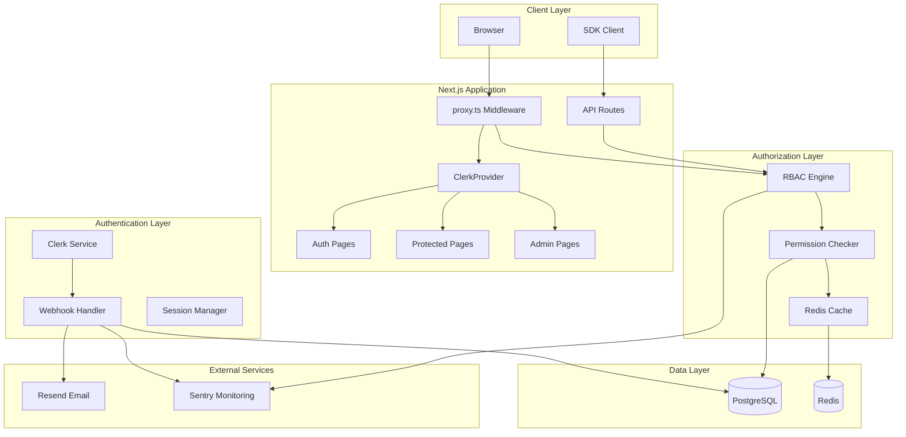
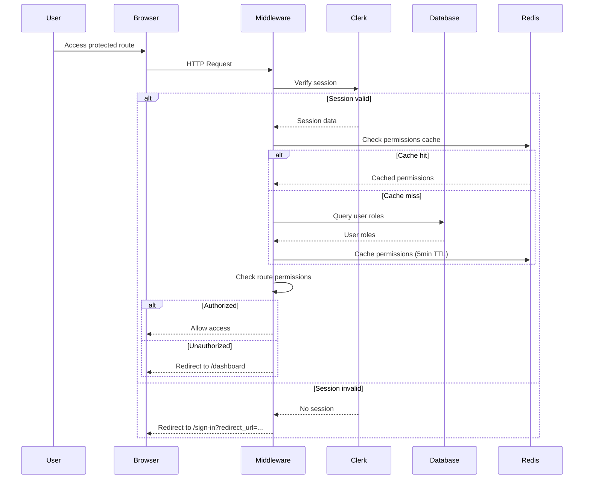
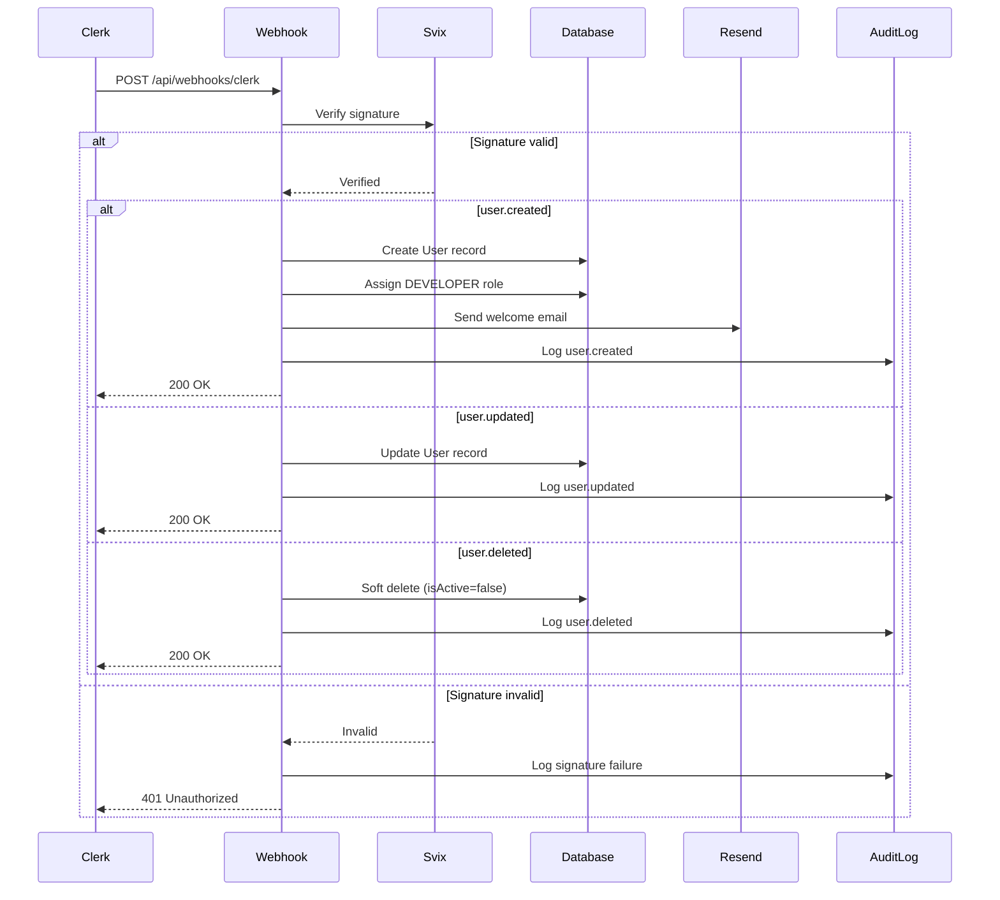

# Design Document: Clerk Authentication & RBAC

## Overview

This design document specifies the technical implementation of a comprehensive authentication and authorization system for GateCtr using Clerk with role-based access control (RBAC). The system provides secure user authentication, session management, webhook synchronization with PostgreSQL, and fine-grained permission controls across six distinct roles.

### Goals

- Integrate Clerk authentication with minimal code changes to existing Next.js 16 App Router architecture
- Implement RBAC system with six roles and granular permissions
- Synchronize Clerk user events with PostgreSQL database via webhooks
- Protect routes and API endpoints based on authentication and authorization
- Support internationalization (English and French) throughout authentication flows
- Implement Redis-based permission caching for performance
- Provide comprehensive audit logging for security and compliance
- Send automated welcome emails to new users

### Non-Goals

- Custom authentication implementation (using Clerk instead)
- Social login providers beyond Google and GitHub OAuth
- Multi-factor authentication configuration (handled by Clerk)
- Custom session management (using Clerk sessions)

### Success Metrics

- Authentication flow completion time < 3 seconds
- Permission check latency < 10ms (cached) and < 100ms (uncached)
- Webhook processing time < 2 seconds
- Zero authentication-related security incidents
- 100% audit log coverage for security events

## Architecture

### System Components



### Authentication Flow



### Webhook Synchronization Flow



### Component Architecture

The system is organized into distinct layers:

1. **Presentation Layer**: React components, pages, and UI elements
2. **Middleware Layer**: Route protection and authentication checks
3. **Business Logic Layer**: RBAC engine, permission checking, webhook processing
4. **Data Access Layer**: Prisma ORM, Redis client
5. **External Integration Layer**: Clerk SDK, Resend, Sentry

## Components and Interfaces

### Core Libraries

#### lib/permissions.ts

Permission checking and RBAC engine implementation.

```typescript
// Permission type definitions
export type Resource = "users" | "analytics" | "billing" | "system" | "audit";

export type Action = "read" | "write" | "delete" | "export";

export type Permission = `${Resource}:${Action}`;

export type RoleName =
  | "SUPER_ADMIN"
  | "ADMIN"
  | "MANAGER"
  | "DEVELOPER"
  | "VIEWER"
  | "SUPPORT";

// Permission matrix
export const ROLE_PERMISSIONS: Record<RoleName, Permission[]>;

// Core functions
export async function hasPermission(
  userId: string,
  permission: Permission,
): Promise<boolean>;

export async function getUserPermissions(userId: string): Promise<Permission[]>;

export async function invalidatePermissionCache(userId: string): Promise<void>;

export async function checkRouteAccess(
  userId: string,
  route: string,
): Promise<boolean>;
```

#### lib/redis.ts

Redis client for permission caching.

```typescript
import { Redis } from "@upstash/redis";

export const redis = new Redis({
  url: process.env.UPSTASH_REDIS_REST_URL!,
  token: process.env.UPSTASH_REDIS_REST_TOKEN!,
});

export const CACHE_TTL = 300; // 5 minutes
export const PERMISSION_CACHE_PREFIX = "permissions:";

export async function getCachedPermissions(
  userId: string,
): Promise<Permission[] | null>;

export async function setCachedPermissions(
  userId: string,
  permissions: Permission[],
): Promise<void>;

export async function invalidateCache(userId: string): Promise<void>;
```

#### lib/audit.ts

Audit logging for security events.

```typescript
export type AuditAction =
  | "user.created"
  | "user.updated"
  | "user.deleted"
  | "role.granted"
  | "role.revoked"
  | "access.denied"
  | "webhook.signature_failed";

export interface AuditLogEntry {
  userId?: string;
  actorId?: string;
  resource: string;
  action: string;
  resourceId?: string;
  oldValue?: any;
  newValue?: any;
  ipAddress?: string;
  userAgent?: string;
  success: boolean;
  error?: string;
}

export async function logAudit(entry: AuditLogEntry): Promise<void>;

export async function getAuditLogs(
  filters: {
    userId?: string;
    resource?: string;
    action?: string;
    startDate?: Date;
    endDate?: Date;
  },
  pagination: {
    page: number;
    pageSize: number;
  },
): Promise<{ logs: AuditLog[]; total: number }>;
```

#### lib/auth.ts (Enhanced)

Enhanced authentication utilities with RBAC integration.

```typescript
import { auth } from "@clerk/nextjs/server";
import { prisma } from "@/lib/prisma";
import { hasPermission, getUserPermissions } from "@/lib/permissions";

export type UserRole =
  | "SUPER_ADMIN"
  | "ADMIN"
  | "MANAGER"
  | "DEVELOPER"
  | "VIEWER"
  | "SUPPORT";

export async function getCurrentUser();

export async function hasRole(role: UserRole): Promise<boolean>;

export async function hasAnyRole(roles: UserRole[]): Promise<boolean>;

export async function isAdmin(): Promise<boolean>;

export async function requireAdmin(): Promise<void>;

export async function getUserRoles(): Promise<UserRole[]>;

export async function requirePermission(permission: Permission): Promise<void>;

export async function hasPermissions(
  permissions: Permission[],
): Promise<boolean>;
```

### API Routes

#### app/api/webhooks/clerk/route.ts

Webhook handler for Clerk user events.

```typescript
import { headers } from "next/headers";
import { Webhook } from "svix";
import { WebhookEvent } from "@clerk/nextjs/server";

export async function POST(req: Request) {
  // 1. Verify webhook signature using Svix
  // 2. Parse webhook event type
  // 3. Handle user.created, user.updated, user.deleted
  // 4. Update database
  // 5. Send welcome email (user.created only)
  // 6. Log audit entry
  // 7. Return 200 OK or appropriate error
}
```

**Endpoints:**

- `POST /api/webhooks/clerk` - Clerk webhook receiver

**Request Headers:**

- `svix-id`: Webhook message ID
- `svix-timestamp`: Webhook timestamp
- `svix-signature`: HMAC signature

**Response Codes:**

- `200`: Successfully processed
- `400`: Invalid payload
- `401`: Invalid signature
- `500`: Server error

#### app/api/auth/permissions/route.ts

Permission checking API for client-side components.

```typescript
export async function GET(req: Request) {
  // 1. Get current user from Clerk session
  // 2. Fetch user permissions (with caching)
  // 3. Return permissions array
}

export async function POST(req: Request) {
  // 1. Get current user from Clerk session
  // 2. Parse requested permission from body
  // 3. Check if user has permission
  // 4. Return boolean result
}
```

**Endpoints:**

- `GET /api/auth/permissions` - Get all user permissions
- `POST /api/auth/permissions/check` - Check specific permission

### React Components

#### components/auth/permission-gate.tsx

Client-side permission checking component.

```typescript
"use client";

interface PermissionGateProps {
  permission: Permission;
  fallback?: React.ReactNode;
  children: React.ReactNode;
}

export function PermissionGate({
  permission,
  fallback,
  children,
}: PermissionGateProps) {
  // Use React Query to fetch and cache permissions
  // Show children if user has permission
  // Show fallback or null if user lacks permission
}
```

#### components/auth/role-gate.tsx

Client-side role checking component.

```typescript
"use client";

interface RoleGateProps {
  roles: RoleName[];
  requireAll?: boolean;
  fallback?: React.ReactNode;
  children: React.ReactNode;
}

export function RoleGate({
  roles,
  requireAll = false,
  fallback,
  children,
}: RoleGateProps) {
  // Check if user has required role(s)
  // Show children if authorized
  // Show fallback or null if unauthorized
}
```

#### components/admin/layout.tsx

Admin area layout with role verification.

```typescript
import { requireAdmin } from '@/lib/auth';

export default async function AdminLayout({
  children
}: {
  children: React.ReactNode;
}) {
  // Server-side role check
  await requireAdmin();

  return (
    <div className="admin-layout">
      <AdminSidebar />
      <main>{children}</main>
    </div>
  );
}
```

#### components/admin/sidebar.tsx

Admin sidebar with permission-filtered menu items.

```typescript
"use client";

export function Sidebar() {
  const permissions = usePermissions();

  const menuItems = [
    { label: "Users", href: "/admin/users", permission: "users:read" },
    { label: "Plans", href: "/admin/plans", permission: "billing:read" },
    {
      label: "Feature Flags",
      href: "/admin/feature-flags",
      permission: "system:read",
    },
    {
      label: "Audit Logs",
      href: "/admin/audit-logs",
      permission: "audit:read",
    },
    {
      label: "System Health",
      href: "/admin/system",
      permission: "system:read",
    },
    { label: "Waitlist", href: "/admin/waitlist", permission: "users:read" },
  ];

  // Filter menu items based on user permissions
  // Render navigation links
}
```

### React Hooks

#### hooks/use-permissions.ts

Client-side hook for permission checking.

```typescript
"use client";

import { useQuery } from "@tanstack/react-query";

export function usePermissions() {
  return useQuery({
    queryKey: ["permissions"],
    queryFn: async () => {
      const res = await fetch("/api/auth/permissions");
      return res.json();
    },
    staleTime: 5 * 60 * 1000, // 5 minutes
  });
}

export function useHasPermission(permission: Permission) {
  const { data: permissions } = usePermissions();
  return permissions?.includes(permission) ?? false;
}

export function useHasAnyPermission(requiredPermissions: Permission[]) {
  const { data: permissions } = usePermissions();
  return requiredPermissions.some((p) => permissions?.includes(p)) ?? false;
}
```

#### hooks/use-roles.ts

Client-side hook for role checking.

```typescript
"use client";

import { useUser } from "@clerk/nextjs";

export function useRoles() {
  const { user } = useUser();
  // Fetch user roles from database via API
  // Return roles array
}

export function useHasRole(role: RoleName) {
  const roles = useRoles();
  return roles?.includes(role) ?? false;
}

export function useIsAdmin() {
  const roles = useRoles();
  return roles?.some((r) => ["SUPER_ADMIN", "ADMIN"].includes(r)) ?? false;
}
```

### Middleware Enhancement

#### proxy.ts (Enhanced)

Enhanced middleware with RBAC integration.

```typescript
import { clerkMiddleware, createRouteMatcher } from "@clerk/nextjs/server";
import { NextResponse } from "next/server";
import createIntlMiddleware from "next-intl/middleware";
import { routing } from "./i18n/routing";
import { checkRouteAccess } from "@/lib/permissions";

const intlMiddleware = createIntlMiddleware(routing);

const isPublicRoute = createRouteMatcher([
  "/",
  "/waitlist",
  "/fr",
  "/fr/waitlist",
  "/api/waitlist(.*)",
  "/sign-in(.*)",
  "/sign-up(.*)",
  "/fr/sign-in(.*)",
  "/fr/sign-up(.*)",
]);

const isAdminRoute = createRouteMatcher(["/admin(.*)", "/fr/admin(.*)"]);

export default clerkMiddleware(async (auth, req) => {
  const { userId } = await auth();
  const { pathname } = req.nextUrl;

  // Skip i18n middleware for API routes
  if (pathname.startsWith("/api")) {
    // Handle webhook routes (no auth required)
    if (pathname.startsWith("/api/webhooks/")) {
      return NextResponse.next();
    }

    // Require auth for other API routes
    if (!isPublicRoute(req) && !userId) {
      return NextResponse.json({ error: "Unauthorized" }, { status: 401 });
    }
    return NextResponse.next();
  }

  // Extract locale
  const localeMatch = pathname.match(/^\/fr(\/|$)/);
  const locale = localeMatch ? "fr" : routing.defaultLocale;

  // Waitlist redirect logic
  const waitlistEnabled = process.env.ENABLE_WAITLIST === "true";
  const signupsDisabled = process.env.ENABLE_SIGNUPS === "false";

  if (waitlistEnabled && signupsDisabled && pathname.includes("/sign-up")) {
    const waitlistPath = locale === "fr" ? "/fr/waitlist" : "/waitlist";
    return NextResponse.redirect(new URL(waitlistPath, req.url));
  }

  // Protect non-public routes
  if (!isPublicRoute(req) && !userId) {
    const signInPath = locale === "fr" ? "/fr/sign-in" : "/sign-in";
    const signInUrl = new URL(signInPath, req.url);
    signInUrl.searchParams.set("redirect_url", pathname);
    return NextResponse.redirect(signInUrl);
  }

  // Admin route protection
  if (isAdminRoute(req) && userId) {
    const hasAccess = await checkRouteAccess(userId, pathname);
    if (!hasAccess) {
      const dashboardPath = locale === "fr" ? "/fr/dashboard" : "/dashboard";
      const dashboardUrl = new URL(dashboardPath, req.url);
      dashboardUrl.searchParams.set("error", "access_denied");
      return NextResponse.redirect(dashboardUrl);
    }
  }

  // Apply i18n middleware
  return intlMiddleware(req);
});

export const config = {
  matcher: [
    "/((?!_next|_vercel|[^?]*\\.(?:html?|css|js(?!on)|jpe?g|webp|png|gif|svg|ttf|woff2?|ico|csv|docx?|xlsx?|zip|webmanifest)).*)",
    "/(api|trpc)(.*)",
  ],
};
```

## Data Models

### Database Schema

The database schema is already defined in `prisma/schema.prisma`. Key models for authentication and RBAC:

#### User Model

```prisma
model User {
  id            String    @id @default(cuid())
  clerkId       String    @unique
  email         String    @unique
  name          String?
  avatarUrl     String?
  plan          PlanType  @default(FREE)
  planExpiresAt DateTime?
  isActive      Boolean   @default(true)
  isBanned      Boolean   @default(false)
  bannedReason  String?
  metadata      Json?     @default("{}")
  createdAt     DateTime  @default(now())
  updatedAt     DateTime  @updatedAt

  userRoles             UserRole[]
  auditLogs             AuditLog[]
  // ... other relations
}
```

#### Role Model

```prisma
model Role {
  id          String   @id @default(cuid())
  name        RoleName @unique
  displayName String
  description String?
  isSystem    Boolean  @default(true)
  createdAt   DateTime @default(now())

  userRoles       UserRole[]
  rolePermissions RolePermission[]
}

enum RoleName {
  SUPER_ADMIN
  ADMIN
  MANAGER
  DEVELOPER
  VIEWER
  SUPPORT
}
```

#### Permission Model

```prisma
model Permission {
  id          String   @id @default(cuid())
  resource    String
  action      String
  description String?

  rolePermissions RolePermission[]

  @@unique([resource, action])
}
```

#### UserRole Model (Junction Table)

```prisma
model UserRole {
  id        String   @id @default(cuid())
  userId    String
  roleId    String
  grantedBy String?
  createdAt DateTime @default(now())

  user User @relation(fields: [userId], references: [id], onDelete: Cascade)
  role Role @relation(fields: [roleId], references: [id])

  @@unique([userId, roleId])
}
```

#### RolePermission Model (Junction Table)

```prisma
model RolePermission {
  roleId       String
  permissionId String

  role       Role       @relation(fields: [roleId], references: [id])
  permission Permission @relation(fields: [permissionId], references: [id])

  @@id([roleId, permissionId])
}
```

#### AuditLog Model

```prisma
model AuditLog {
  id         String   @id @default(cuid())
  userId     String?
  actorId    String?
  resource   String
  action     String
  resourceId String?
  oldValue   Json?
  newValue   Json?
  ipAddress  String?
  userAgent  String?
  success    Boolean  @default(true)
  error      String?
  createdAt  DateTime @default(now())

  user User? @relation(fields: [userId], references: [id])

  @@index([userId, createdAt])
  @@index([resource, action])
  @@index([createdAt])
}
```

### Permission Matrix

The permission matrix defines which permissions each role has:

| Permission       | SUPER_ADMIN | ADMIN | MANAGER | DEVELOPER | VIEWER | SUPPORT |
| ---------------- | ----------- | ----- | ------- | --------- | ------ | ------- |
| users:read       | ✓           | ✓     | ✓       | ✗         | ✗      | ✓       |
| users:write      | ✓           | ✓     | ✗       | ✗         | ✗      | ✗       |
| users:delete     | ✓           | ✗     | ✗       | ✗         | ✗      | ✗       |
| analytics:read   | ✓           | ✓     | ✓       | ✓         | ✓      | ✗       |
| analytics:export | ✓           | ✓     | ✗       | ✗         | ✗      | ✗       |
| billing:read     | ✓           | ✓     | ✓       | ✗         | ✗      | ✗       |
| billing:write    | ✓           | ✓     | ✗       | ✗         | ✗      | ✗       |
| system:read      | ✓           | ✓     | ✗       | ✗         | ✗      | ✗       |
| audit:read       | ✓           | ✓     | ✗       | ✗         | ✗      | ✓       |

**Implementation in code:**

```typescript
export const ROLE_PERMISSIONS: Record<RoleName, Permission[]> = {
  SUPER_ADMIN: [
    "users:read",
    "users:write",
    "users:delete",
    "analytics:read",
    "analytics:export",
    "billing:read",
    "billing:write",
    "system:read",
    "audit:read",
  ],
  ADMIN: [
    "users:read",
    "users:write",
    "analytics:read",
    "analytics:export",
    "billing:read",
    "billing:write",
    "system:read",
    "audit:read",
  ],
  MANAGER: ["analytics:read", "users:read", "billing:read"],
  DEVELOPER: ["analytics:read"],
  VIEWER: ["analytics:read"],
  SUPPORT: ["users:read", "audit:read"],
};
```

### Redis Cache Structure

Permission cache keys follow this pattern:

```
permissions:{userId} -> ["users:read", "analytics:read", ...]
```

**Cache Strategy:**

- TTL: 5 minutes (300 seconds)
- Invalidation: On role grant/revoke
- Fallback: Direct database query if Redis unavailable

### Webhook Event Payloads

#### user.created Event

```json
{
  "type": "user.created",
  "data": {
    "id": "user_2abc123",
    "email_addresses": [
      {
        "email_address": "user@example.com",
        "id": "idn_123"
      }
    ],
    "first_name": "John",
    "last_name": "Doe",
    "image_url": "https://img.clerk.com/...",
    "created_at": 1234567890000,
    "updated_at": 1234567890000
  }
}
```

#### user.updated Event

```json
{
  "type": "user.updated",
  "data": {
    "id": "user_2abc123",
    "email_addresses": [
      {
        "email_address": "newemail@example.com",
        "id": "idn_123"
      }
    ],
    "first_name": "John",
    "last_name": "Smith",
    "image_url": "https://img.clerk.com/...",
    "updated_at": 1234567891000
  }
}
```

#### user.deleted Event

```json
{
  "type": "user.deleted",
  "data": {
    "id": "user_2abc123",
    "deleted": true
  }
}
```

## Correctness Properties

_A property is a characteristic or behavior that should hold true across all valid executions of a system-essentially, a formal statement about what the system should do. Properties serve as the bridge between human-readable specifications and machine-verifiable correctness guarantees._

### Property Reflection

After analyzing all acceptance criteria, I identified the following redundancies:

- **Webhook signature verification** (3.1, 8.1): Combined into single property
- **Webhook signature failure handling** (3.2, 8.2): Combined into single property
- **Audit logging for user creation** (3.6, 9.1): Combined into single property
- **Audit logging for user deletion** (3.9, 9.2): Combined into single property
- **Audit logging for access denial** (8.7, 9.3): Combined into single property
- **Default DEVELOPER role** (4.8, 8.10): Combined into single property
- **Welcome email sending** (3.5, 11.1): Combined into single property
- **Redis fallback** (10.8, 18.3): Combined into single property
- **Email failure handling** (11.5, 18.4): Combined into single property
- **Redirect URL sanitization** (8.6, 17.5): Combined into single property
- **Locale preservation** (2.4, 2.7): Combined into single property

The following properties provide unique validation value and will be included:

### Property 1: Session Creation on Authentication

_For any_ valid user credentials, when authentication succeeds, the system should create a session that can be retrieved on subsequent requests.

**Validates: Requirements 1.3**

### Property 2: Authentication Redirect Preservation

_For any_ successful sign-in, the system should redirect to the dashboard route in the user's locale (/dashboard for English, /fr/dashboard for French).

**Validates: Requirements 1.4**

### Property 3: Session Persistence Round-Trip

_For any_ authenticated user, navigating away from and back to a protected route should preserve the session without requiring re-authentication.

**Validates: Requirements 1.6, 15.1, 15.2, 15.3**

### Property 4: Sign-Out Session Termination

_For any_ authenticated user, signing out should terminate the session such that subsequent access to protected routes requires re-authentication.

**Validates: Requirements 1.7, 15.4**

### Property 5: Locale-Aware UI Rendering

_For any_ authentication UI component and any supported locale (en, fr), the component should display text in the selected locale.

**Validates: Requirements 1.8, 6.9, 7.8**

### Property 6: Unauthenticated Protected Route Redirect

_For any_ protected route and any unauthenticated request, the middleware should redirect to /sign-in with the original URL as the redirect_url parameter.

**Validates: Requirements 2.1**

### Property 7: Authenticated Protected Route Access

_For any_ authenticated user with appropriate permissions and any protected route, the middleware should allow the request to proceed.

**Validates: Requirements 2.3**

### Property 8: Locale Preservation Through Authentication

_For any_ locale and any authentication redirect, the system should preserve the locale in the redirect URL.

**Validates: Requirements 2.4, 2.7, 17.4**

### Property 9: Unauthenticated API Route Rejection

_For any_ protected API route and any request without valid credentials, the middleware should return HTTP 401 with error message "Unauthorized".

**Validates: Requirements 2.5**

### Property 10: Webhook Signature Verification

_For any_ incoming webhook event, the webhook handler should verify the signature using Svix before processing.

**Validates: Requirements 3.1, 8.1**

### Property 11: Invalid Webhook Signature Rejection

_For any_ webhook event with invalid signature, the webhook handler should return HTTP 401 and log a security violation to the audit log.

**Validates: Requirements 3.2, 8.2, 9.7**

### Property 12: User Creation from Webhook

_For any_ valid user.created webhook event, the webhook handler should create a User record in the database with clerkId, email, and name fields populated.

**Validates: Requirements 3.3**

### Property 13: Default Role Assignment

_For any_ newly created user, the system should assign the DEVELOPER role by default.

**Validates: Requirements 3.4, 4.8, 8.10**

### Property 14: Welcome Email Sending

_For any_ valid user.created webhook event, the webhook handler should send a welcome email via Resend containing the user's name, welcome message, and dashboard link.

**Validates: Requirements 3.5, 11.1, 11.2**

### Property 15: User Creation Audit Logging

_For any_ valid user.created webhook event, the webhook handler should create an audit log entry with resource "user", action "created", and the user's ID.

**Validates: Requirements 3.6, 9.1**

### Property 16: User Update from Webhook

_For any_ valid user.updated webhook event, the webhook handler should update the User record with new email, name, and avatarUrl values.

**Validates: Requirements 3.7**

### Property 17: User Soft Delete from Webhook

_For any_ valid user.deleted webhook event, the webhook handler should set isActive to false without removing the database record.

**Validates: Requirements 3.8**

### Property 18: User Deletion Audit Logging

_For any_ valid user.deleted webhook event, the webhook handler should create an audit log entry with resource "user", action "deleted", and the user's ID.

**Validates: Requirements 3.9, 9.2**

### Property 19: Successful Webhook Response

_For any_ successfully processed webhook event, the webhook handler should return HTTP 200.

**Validates: Requirements 3.10**

### Property 20: Webhook Database Error Handling

_For any_ webhook event where database operations fail, the webhook handler should return HTTP 500 and log the error.

**Validates: Requirements 3.11, 18.2**

### Property 21: Permission Matrix Correctness

_For any_ role and any permission, the has(permission) function should return true if and only if the permission is explicitly defined in the permission matrix for that role.

**Validates: Requirements 5.3, 5.4, 13.1, 13.2, 13.3**

### Property 22: Multiple Role Permission Union

_For any_ user with multiple roles, the system should grant the union of all permissions from all assigned roles.

**Validates: Requirements 4.9, 13.4**

### Property 23: No Role Permission Denial

_For any_ user with no roles and any permission, the has(permission) function should return false.

**Validates: Requirements 13.5**

### Property 24: Permission Cache Hit Performance

_For any_ permission check with valid cache entry, the system should return results within 10 milliseconds.

**Validates: Requirements 5.7, 5.8, 10.1**

### Property 25: Permission Cache Expiration

_For any_ cached permission that has exceeded the 5-minute TTL, the system should refresh from the database and update the cache.

**Validates: Requirements 5.9**

### Property 26: Permission Cache Invalidation on Role Change

_For any_ user whose roles are modified (granted or revoked), the system should invalidate the permission cache for that user.

**Validates: Requirements 5.10, 16.1, 16.2**

### Property 27: Permission Check Idempotence

_For any_ user and permission, repeated permission checks within the cache TTL period should return consistent results.

**Validates: Requirements 13.6**

### Property 28: Role Modification Inverse Property

_For any_ user, adding then removing a role should return the user to their original permission state.

**Validates: Requirements 13.7**

### Property 29: Admin Area Access Control

_For any_ user accessing admin routes (/admin/_ or /fr/admin/_), the system should verify the user has one of the following roles: SUPER_ADMIN, ADMIN, MANAGER, or SUPPORT.

**Validates: Requirements 6.2, 8.4**

### Property 30: Admin Area Unauthorized Redirect

_For any_ user without admin roles attempting to access admin routes, the system should redirect to /dashboard with error message "Access denied: Admin privileges required".

**Validates: Requirements 6.3**

### Property 31: Menu Item Permission Filtering

_For any_ user and any admin sidebar menu item, the menu item should be displayed if and only if the user has the required permission for that menu item.

**Validates: Requirements 6.4**

### Property 32: Locale Switch Session Persistence

_For any_ authenticated user switching language, the system should maintain the session and redirect to the equivalent localized route.

**Validates: Requirements 7.7, 15.5**

### Property 33: Welcome Email Locale Selection

_For any_ new user, the welcome email should be sent in the user's browser locale if detectable, defaulting to English.

**Validates: Requirements 7.9**

### Property 34: Redirect URL Sanitization

_For any_ redirect_url parameter pointing to an external domain, the middleware should ignore it and redirect to /dashboard instead.

**Validates: Requirements 8.6, 17.5**

### Property 35: Access Denial Audit Logging

_For any_ user denied access to a protected resource, the system should create an audit log entry with resource name, action "access_denied", user ID, and timestamp.

**Validates: Requirements 8.7, 9.3**

### Property 36: Role Grant Audit Logging

_For any_ role granted to a user, the system should create an audit log entry with resource "role", action "granted", user ID, role ID, grantedBy, and timestamp.

**Validates: Requirements 9.4**

### Property 37: Role Revoke Audit Logging

_For any_ role revoked from a user, the system should create an audit log entry with resource "role", action "revoked", user ID, role ID, and timestamp.

**Validates: Requirements 9.5**

### Property 38: Audit Log Metadata Capture

_For any_ audit log entry, the system should store ipAddress and userAgent when available.

**Validates: Requirements 9.6**

### Property 39: Audit Log Access Control

_For any_ user with audit:read permission, the admin area should provide access to audit logs.

**Validates: Requirements 9.8**

### Property 40: Permission Check Database Performance

_For any_ permission check requiring database query (cache miss), the system should return results within 100 milliseconds.

**Validates: Requirements 10.2**

### Property 41: Middleware Authentication Performance

_For any_ authentication check with cached session, the middleware should complete within 50 milliseconds.

**Validates: Requirements 10.4**

### Property 42: Webhook Processing Performance

_For any_ user.created webhook event, the webhook handler should complete processing (including database writes and email sending) within 2 seconds.

**Validates: Requirements 10.5**

### Property 43: Redis Unavailable Fallback

_For any_ permission check when Redis is unavailable, the system should fall back to direct database queries without failing the request.

**Validates: Requirements 10.8, 18.3**

### Property 44: Welcome Email Asynchronous Sending

_For any_ user.created webhook, the welcome email should be sent asynchronously such that the webhook returns HTTP 200 even if email sending is slow.

**Validates: Requirements 11.4**

### Property 45: Welcome Email Failure Resilience

_For any_ user.created webhook where email sending fails, the webhook handler should log the error but still return HTTP 200 and complete user creation.

**Validates: Requirements 11.5, 18.4**

### Property 46: Email Logging

_For any_ welcome email sent, the system should record the attempt in the EmailLog table with status SENT or FAILED.

**Validates: Requirements 11.7**

### Property 47: Welcome Email Unsubscribe Link

_For any_ welcome email, the email should include an unsubscribe link.

**Validates: Requirements 11.8**

### Property 48: Webhook Idempotency - User Creation

_For any_ user.created webhook event processed multiple times, the system should create only one User record.

**Validates: Requirements 14.1**

### Property 49: Webhook Idempotency - User Update

_For any_ user.updated webhook event processed multiple times, the system should produce the same final User state.

**Validates: Requirements 14.2**

### Property 50: Webhook Idempotency - User Deletion

_For any_ user.deleted webhook event processed multiple times, the system should maintain isActive as false without errors.

**Validates: Requirements 14.3**

### Property 51: Webhook Idempotency General

_For any_ webhook event, processing the event N times should produce the same database state as processing it once.

**Validates: Requirements 14.4**

### Property 52: Duplicate Webhook Detection

_For any_ duplicate webhook detected by event ID, the webhook handler should return HTTP 200 without performing duplicate operations.

**Validates: Requirements 14.6**

### Property 53: Session Refresh Persistence

_For any_ authenticated user refreshing the page on a protected route, the system should restore the session from cookies.

**Validates: Requirements 15.2**

### Property 54: Cache Invalidation Freshness

_For any_ cache invalidation operation, subsequent permission checks should reflect updated permissions within 100 milliseconds.

**Validates: Requirements 16.4**

### Property 55: Cache Miss Database Fetch

_For any_ permission check after cache invalidation, the system should fetch fresh data from the database.

**Validates: Requirements 16.5**

### Property 56: Redirect URL Completion

_For any_ user completing sign-in with a redirect_url parameter, the system should redirect to the specified URL.

**Validates: Requirements 17.2**

### Property 57: Query Parameter Preservation

_For any_ redirect_url with query parameters, the middleware should preserve all query parameters in the redirect.

**Validates: Requirements 17.3**

### Property 58: Redirect URL Encoding

_For any_ redirect_url with special characters, the middleware should URL-encode the parameter.

**Validates: Requirements 17.6**

### Property 59: Clerk Service Error Handling

_For any_ request when Clerk service is unavailable, the system should display a user-friendly error message in the appropriate locale.

**Validates: Requirements 18.1**

### Property 60: Malformed Webhook Rejection

_For any_ webhook with malformed payload, the webhook handler should return HTTP 400 with error details.

**Validates: Requirements 18.5**

### Property 61: Role Modification Race Condition Handling

_For any_ concurrent requests modifying user roles, the system should handle race conditions without data corruption.

**Validates: Requirements 18.6**

### Property 62: Permission Check Fail-Secure

_For any_ permission check that fails due to errors, the system should deny access.

**Validates: Requirements 18.7**

### Property 63: Error Logging to Sentry

_For any_ error in the authentication or authorization system, the system should log the error to Sentry with appropriate context.

**Validates: Requirements 18.8**

## Error Handling

### Authentication Errors

**Clerk Service Unavailable**

- Display user-friendly error message in appropriate locale
- Log error to Sentry with context
- Provide retry mechanism
- Fallback to cached session data if available

**Invalid Session**

- Redirect to sign-in page with redirect_url
- Clear invalid session cookies
- Log security event to audit log

**Session Expired**

- Redirect to sign-in page with redirect_url
- Display "Session expired" message in appropriate locale
- Preserve user's intended destination

### Authorization Errors

**Insufficient Permissions**

- Return HTTP 403 for API routes
- Redirect to dashboard with error message for web routes
- Log access denial to audit log with user ID, resource, and timestamp
- Display error message in user's locale

**Invalid Role Assignment**

- Validate role exists before assignment
- Log error to Sentry
- Return descriptive error message
- Rollback transaction on failure

**Cache Unavailable**

- Fall back to direct database queries
- Log Redis connection error to Sentry
- Continue serving requests without caching
- Alert operations team via monitoring

### Webhook Errors

**Invalid Signature**

- Return HTTP 401
- Log security violation to audit log with IP address
- Alert security team via monitoring
- Do not process webhook payload

**Malformed Payload**

- Return HTTP 400 with error details
- Log error to Sentry with payload sample
- Do not process webhook

**Database Error**

- Return HTTP 500 to trigger Clerk retry
- Log error to Sentry with full context
- Rollback any partial database changes
- Alert operations team

**Email Sending Failure**

- Log error to Sentry
- Record FAILED status in EmailLog table
- Continue webhook processing (return HTTP 200)
- Queue email for retry via background job

### Database Errors

**Connection Failure**

- Retry with exponential backoff (3 attempts)
- Log error to Sentry
- Return HTTP 503 Service Unavailable
- Alert operations team

**Query Timeout**

- Log slow query to Sentry
- Return HTTP 504 Gateway Timeout
- Alert operations team for query optimization

**Constraint Violation**

- Handle unique constraint violations gracefully
- Return descriptive error message
- Log to Sentry for investigation

### Redis Errors

**Connection Failure**

- Fall back to direct database queries
- Log error to Sentry
- Continue serving requests
- Alert operations team

**Cache Corruption**

- Invalidate corrupted cache entry
- Fetch fresh data from database
- Log error to Sentry

### Error Response Format

**API Routes**

```typescript
{
  "error": "Unauthorized",
  "message": "You do not have permission to access this resource",
  "code": "INSUFFICIENT_PERMISSIONS",
  "timestamp": "2025-01-15T10:30:00Z"
}
```

**Web Routes**

- Redirect to appropriate page with error query parameter
- Display toast notification with error message
- Log error for debugging

### Monitoring and Alerting

**Critical Errors** (Immediate Alert)

- Webhook signature verification failures
- Database connection failures
- Authentication service unavailable
- Multiple permission check failures

**Warning Errors** (Delayed Alert)

- Email sending failures
- Cache unavailable
- Slow query performance
- High error rate (>1% of requests)

**Info Errors** (Logged Only)

- Invalid redirect URLs
- Malformed webhook payloads
- Individual permission denials

## Testing Strategy

### Dual Testing Approach

The testing strategy employs both unit tests and property-based tests to ensure comprehensive coverage:

- **Unit tests**: Verify specific examples, edge cases, and error conditions
- **Property-based tests**: Verify universal properties across all inputs

Both approaches are complementary and necessary. Unit tests catch concrete bugs in specific scenarios, while property-based tests verify general correctness across a wide range of inputs.

### Unit Testing

Unit tests focus on:

**Specific Examples**

- Sign-in page exists at /sign-in and /fr/sign-in
- Sign-up page exists at /sign-up and /fr/sign-up
- Public routes (/, /waitlist, /api/waitlist) allow unauthenticated access
- SUPER_ADMIN role has all 9 permissions
- ADMIN role has 8 specific permissions
- MANAGER role has 3 specific permissions
- DEVELOPER role has 1 permission (analytics:read)
- VIEWER role has 1 permission (analytics:read)
- SUPPORT role has 2 permissions
- Cache TTL is 5 minutes (300 seconds)
- Welcome email subject is "Welcome to GateCtr" (English) or "Bienvenue sur GateCtr" (French)
- Unauthenticated access to /dashboard redirects to /sign-in?redirect_url=/dashboard
- ClerkProvider is configured with NEXT_PUBLIC_CLERK_PUBLISHABLE_KEY
- Clerk hooks (useUser, useAuth, useClerk) are available to components

**Edge Cases**

- User with no roles has no permissions
- Empty redirect_url parameter
- Redirect_url with special characters
- Webhook with missing required fields
- Concurrent role modifications
- Cache corruption scenarios

**Integration Points**

- Clerk webhook signature verification with Svix
- Resend email sending
- Redis cache operations
- Prisma database queries
- Sentry error logging

**Error Conditions**

- Invalid webhook signature returns HTTP 401
- Malformed webhook payload returns HTTP 400
- Database error during webhook returns HTTP 500
- Redis unavailable falls back to database
- Email sending failure logs error but returns HTTP 200
- Permission check error denies access (fail-secure)

### Property-Based Testing

Property-based tests verify universal properties using randomized inputs. Each test should run a minimum of 100 iterations.

**Configuration**

- Library: `fast-check` (JavaScript/TypeScript property-based testing library)
- Minimum iterations: 100 per test
- Timeout: 30 seconds per test
- Shrinking: Enabled (to find minimal failing examples)

**Test Tagging**
Each property-based test must include a comment tag referencing the design document property:

```typescript
/**
 * Feature: clerk-auth-rbac, Property 21: Permission Matrix Correctness
 *
 * For any role and any permission, the has(permission) function should return
 * true if and only if the permission is explicitly defined in the permission
 * matrix for that role.
 */
test("permission matrix correctness", async () => {
  await fc.assert(
    fc.asyncProperty(
      fc.constantFrom(...Object.keys(ROLE_PERMISSIONS)),
      fc.constantFrom(...ALL_PERMISSIONS),
      async (role, permission) => {
        const user = await createUserWithRole(role);
        const hasPermission = await has(user.id, permission);
        const shouldHave = ROLE_PERMISSIONS[role].includes(permission);
        expect(hasPermission).toBe(shouldHave);
      },
    ),
    { numRuns: 100 },
  );
});
```

**Property Test Categories**

1. **Round-Trip Properties**
   - Session persistence (Property 3)
   - Locale preservation (Property 8, 32)
   - Role modification inverse (Property 28)

2. **Idempotence Properties**
   - Permission check consistency (Property 27)
   - Webhook idempotency (Properties 48, 49, 50, 51)

3. **Invariant Properties**
   - Permission matrix correctness (Property 21)
   - Multiple role permission union (Property 22)
   - No role permission denial (Property 23)

4. **Error Handling Properties**
   - Invalid signature rejection (Property 11)
   - Redis fallback (Property 43)
   - Email failure resilience (Property 45)
   - Fail-secure behavior (Property 62)

5. **Performance Properties**
   - Cache hit performance < 10ms (Property 24)
   - Database query performance < 100ms (Property 40)
   - Middleware performance < 50ms (Property 41)
   - Webhook processing < 2s (Property 42)

**Generators**

Custom generators for property-based tests:

```typescript
// Generate random user with random roles
const userWithRolesGen = fc.record({
  clerkId: fc.uuid(),
  email: fc.emailAddress(),
  name: fc.fullName(),
  roles: fc.array(fc.constantFrom(...Object.keys(ROLE_PERMISSIONS)), {
    minLength: 0,
    maxLength: 3,
  }),
});

// Generate random permission
const permissionGen = fc.constantFrom(...ALL_PERMISSIONS);

// Generate random webhook event
const webhookEventGen = fc.oneof(
  userCreatedEventGen,
  userUpdatedEventGen,
  userDeletedEventGen,
);

// Generate random locale
const localeGen = fc.constantFrom("en", "fr");

// Generate random protected route
const protectedRouteGen = fc.constantFrom(
  "/dashboard",
  "/analytics",
  "/projects",
  "/api-keys",
  "/admin/users",
  "/admin/plans",
);
```

### Test Organization

```
tests/
├── unit/
│   ├── auth/
│   │   ├── permissions.test.ts
│   │   ├── roles.test.ts
│   │   └── session.test.ts
│   ├── webhooks/
│   │   ├── clerk-webhook.test.ts
│   │   └── signature-verification.test.ts
│   ├── middleware/
│   │   └── proxy.test.ts
│   └── components/
│       ├── permission-gate.test.tsx
│       └── role-gate.test.tsx
├── integration/
│   ├── auth-flow.test.ts
│   ├── webhook-sync.test.ts
│   └── admin-access.test.ts
├── property/
│   ├── permission-matrix.property.test.ts
│   ├── webhook-idempotency.property.test.ts
│   ├── session-persistence.property.test.ts
│   ├── cache-behavior.property.test.ts
│   └── error-handling.property.test.ts
└── e2e/
    ├── sign-in-flow.spec.ts
    ├── admin-area.spec.ts
    └── locale-switching.spec.ts
```

### Test Coverage Goals

- Unit test coverage: >80% of code
- Property test coverage: All 63 correctness properties
- Integration test coverage: All critical user flows
- E2E test coverage: All major user journeys

### Continuous Integration

All tests run on:

- Pull request creation
- Commit to main branch
- Nightly scheduled runs (property tests with 1000 iterations)

**CI Pipeline**

1. Lint and type check
2. Unit tests (fast)
3. Property tests (100 iterations)
4. Integration tests
5. E2E tests (Playwright)
6. Coverage report generation

## Implementation Notes

### Environment Variables

Required environment variables for the feature:

```bash
# Clerk Configuration
NEXT_PUBLIC_CLERK_PUBLISHABLE_KEY=pk_test_...
CLERK_SECRET_KEY=sk_test_...
CLERK_WEBHOOK_SECRET=whsec_...

# Database
DATABASE_URL=postgresql://...

# Redis (Upstash)
UPSTASH_REDIS_REST_URL=https://...
UPSTASH_REDIS_REST_TOKEN=...

# Email (Resend)
RESEND_API_KEY=re_...

# Monitoring (Sentry)
SENTRY_DSN=https://...
SENTRY_AUTH_TOKEN=...

# Feature Flags
ENABLE_WAITLIST=true
ENABLE_SIGNUPS=false
```

### Database Seeding

The database must be seeded with roles and permissions before the system can function:

```typescript
// prisma/seed.ts

const roles = [
  {
    name: "SUPER_ADMIN",
    displayName: "Super Administrator",
    description: "Full system access",
  },
  {
    name: "ADMIN",
    displayName: "Administrator",
    description: "Administrative access",
  },
  { name: "MANAGER", displayName: "Manager", description: "Management access" },
  {
    name: "DEVELOPER",
    displayName: "Developer",
    description: "Developer access",
  },
  { name: "VIEWER", displayName: "Viewer", description: "Read-only access" },
  { name: "SUPPORT", displayName: "Support", description: "Support access" },
];

const permissions = [
  { resource: "users", action: "read", description: "View users" },
  {
    resource: "users",
    action: "write",
    description: "Create and update users",
  },
  { resource: "users", action: "delete", description: "Delete users" },
  { resource: "analytics", action: "read", description: "View analytics" },
  {
    resource: "analytics",
    action: "export",
    description: "Export analytics data",
  },
  {
    resource: "billing",
    action: "read",
    description: "View billing information",
  },
  { resource: "billing", action: "write", description: "Manage billing" },
  { resource: "system", action: "read", description: "View system settings" },
  { resource: "audit", action: "read", description: "View audit logs" },
];

// Create roles and permissions, then link them according to permission matrix
```

### Clerk Dashboard Configuration

**Webhook Setup**

1. Navigate to Clerk Dashboard → Webhooks
2. Add endpoint: `https://yourdomain.com/api/webhooks/clerk`
3. Subscribe to events: `user.created`, `user.updated`, `user.deleted`
4. Copy webhook secret to `CLERK_WEBHOOK_SECRET` environment variable

**OAuth Providers**

1. Navigate to Clerk Dashboard → Social Connections
2. Enable Google OAuth
3. Enable GitHub OAuth
4. Configure OAuth redirect URLs

**Session Settings**

1. Navigate to Clerk Dashboard → Sessions
2. Set session lifetime: 7 days
3. Enable multi-session support
4. Configure session token claims (if needed)

### Migration Strategy

**Phase 1: Setup (Week 1)**

- Install Clerk SDK and dependencies
- Configure environment variables
- Seed database with roles and permissions
- Set up Clerk webhook endpoint

**Phase 2: Authentication (Week 2)**

- Implement ClerkProvider in root layout
- Create sign-in and sign-up pages
- Enhance middleware with authentication checks
- Add locale support to auth pages

**Phase 3: Authorization (Week 3)**

- Implement RBAC engine and permission checking
- Add Redis caching layer
- Create permission checking utilities
- Implement audit logging

**Phase 4: Webhook Integration (Week 4)**

- Implement webhook handler
- Add signature verification
- Implement user synchronization
- Add welcome email sending

**Phase 5: Admin Area (Week 5)**

- Create admin layout with role verification
- Implement permission-filtered sidebar
- Add admin pages with access control
- Add internationalization support

**Phase 6: Testing & Polish (Week 6)**

- Write unit tests
- Write property-based tests
- Conduct security review
- Performance optimization
- Documentation

### Performance Optimization

**Caching Strategy**

- Cache user permissions in Redis with 5-minute TTL
- Cache role-permission mappings in memory (rarely changes)
- Use Clerk's built-in session caching
- Implement request-level caching for repeated permission checks

**Database Optimization**

- Add indexes on frequently queried fields (userId, clerkId, roleId)
- Use database connection pooling
- Batch permission queries when checking multiple permissions
- Use read replicas for permission checks (if available)

**Middleware Optimization**

- Minimize middleware logic
- Cache route matchers
- Use early returns for public routes
- Avoid unnecessary database queries

### Security Considerations

**Webhook Security**

- Always verify webhook signatures using Svix
- Use HTTPS for webhook endpoint
- Rate limit webhook endpoint
- Log all signature verification failures
- Alert security team on repeated failures

**Session Security**

- Use secure, httpOnly cookies for sessions
- Implement CSRF protection
- Set appropriate session timeouts
- Invalidate sessions on password change
- Monitor for session hijacking attempts

**Permission Security**

- Never expose permission logic in client-side code
- Always verify permissions server-side
- Use fail-secure approach (deny by default)
- Log all permission denials
- Regularly audit permission assignments

**Redirect Security**

- Validate redirect URLs against whitelist
- Reject external domain redirects
- URL-encode redirect parameters
- Log suspicious redirect attempts

**API Security**

- Require authentication for all non-public API routes
- Validate all input parameters
- Use rate limiting
- Implement request signing for sensitive operations
- Log all API access attempts

### Monitoring and Observability

**Metrics to Track**

- Authentication success/failure rate
- Permission check latency (p50, p95, p99)
- Webhook processing time
- Cache hit rate
- Error rate by type
- Session duration

**Alerts to Configure**

- Webhook signature verification failures (immediate)
- High authentication failure rate (5 minutes)
- Database connection failures (immediate)
- Redis unavailable (5 minutes)
- High permission check latency (10 minutes)
- Email sending failure rate >10% (15 minutes)

**Logging Strategy**

- Log all authentication events
- Log all permission denials
- Log all webhook events
- Log all errors with full context
- Use structured logging (JSON format)
- Include request ID for tracing

### Internationalization Implementation

**Translation Files to Create**

- `messages/en/auth.json` - Authentication pages (English)
- `messages/fr/auth.json` - Authentication pages (French)
- Update `messages/en/admin.json` - Admin area additions
- Update `messages/fr/admin.json` - Admin area additions

**i18n/request.ts Update**

```typescript
const messages = {
  common: (await import(`../messages/${locale}/common.json`)).default,
  waitlist: (await import(`../messages/${locale}/waitlist.json`)).default,
  admin: (await import(`../messages/${locale}/admin.json`)).default,
  auth: (await import(`../messages/${locale}/auth.json`)).default, // Add this
};
```

### Dependencies to Install

```bash
pnpm add svix fast-check
pnpm add -D @types/bcryptjs
```

**Existing Dependencies (Already Installed)**

- `@clerk/nextjs` - Clerk SDK
- `@upstash/redis` - Redis client
- `@prisma/client` - Database ORM
- `resend` - Email service
- `@sentry/nextjs` - Error monitoring
- `next-intl` - Internationalization
- `zod` - Schema validation

## Summary

This design document provides a comprehensive blueprint for implementing Clerk authentication and RBAC in the GateCtr platform. The system is built on the following key principles:

**Architecture**

- Layered architecture with clear separation of concerns
- Clerk handles authentication, custom RBAC handles authorization
- Redis caching for performance, PostgreSQL for persistence
- Webhook-based synchronization between Clerk and database

**Security**

- Webhook signature verification using Svix
- Fail-secure permission checking (deny by default)
- Comprehensive audit logging for all security events
- Redirect URL sanitization to prevent open redirects
- Server-side permission verification (never client-side)

**Performance**

- Redis caching with 5-minute TTL for permissions
- <10ms permission checks (cached), <100ms (uncached)
- <50ms middleware authentication checks
- <2s webhook processing including email sending
- Graceful degradation when Redis unavailable

**Reliability**

- Idempotent webhook processing
- Graceful error handling with fallbacks
- Comprehensive error logging to Sentry
- Database transaction rollbacks on failures
- Asynchronous email sending to avoid blocking

**Internationalization**

- Full support for English and French
- Locale-aware authentication pages
- Translated error messages
- Locale preservation through authentication flows

**Testing**

- Dual approach: unit tests + property-based tests
- 63 correctness properties covering all requirements
- 100+ iterations per property test
- Comprehensive coverage of edge cases and error conditions

**Maintainability**

- Clear component boundaries and interfaces
- Well-documented permission matrix
- Structured error handling
- Comprehensive monitoring and alerting
- Detailed implementation notes

The implementation follows a 6-week phased approach, starting with basic authentication and progressively adding authorization, webhook integration, admin area, and comprehensive testing. The design ensures that all 18 requirements are met with 63 testable correctness properties providing formal verification of system behavior.
