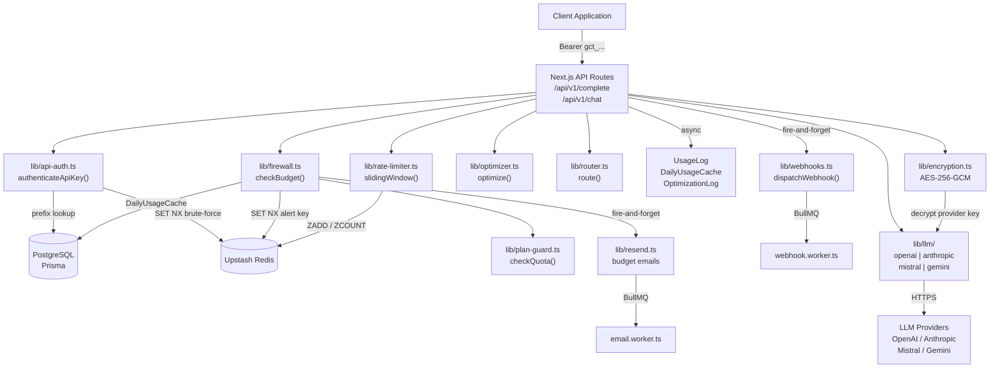
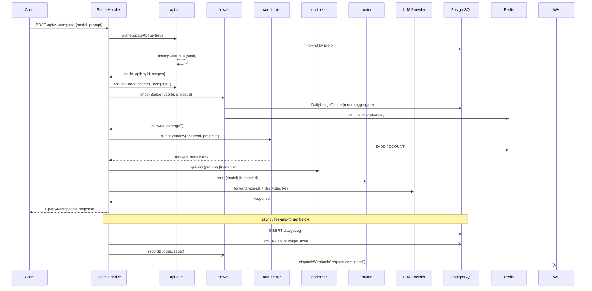

# Design Document: Core API & Budget Firewall

## Overview

The Core API & Budget Firewall is the production-ready LLM gateway layer of GateCtr. It sits between user applications and upstream LLM providers (OpenAI, Anthropic, Mistral, Gemini), enforcing authentication, budget caps, rate limits, and cost tracking on every request — transparently, with zero code changes required from callers.

The gateway accepts OpenAI-compatible request/response shapes on `POST /api/v1/complete` and `POST /api/v1/chat`, resolves the target provider from the model catalog, decrypts the user's stored provider key, forwards the request, logs usage, and dispatches webhook events — all within a strictly ordered pipeline.

Key design goals:
- **< 50 ms gateway overhead** on cache-warm paths (auth + budget + rate limit)
- **Exactly-once budget alerts** per billing period via Redis SET NX
- **Fail-open** for Redis unavailability — never reject requests due to cache failures
- **Constant-time hash comparison** to prevent timing attacks on API key auth
- **Fire-and-forget** for all post-response side effects (usage log, webhooks, emails)

---

## Architecture

### High-Level Component Diagram



### Request Pipeline (Strict Order)



---

## Components and Interfaces

### lib/encryption.ts

AES-256-GCM symmetric encryption for LLM provider keys. The encryption key is read from `ENCRYPTION_KEY` env var (32-byte hex string).

```typescript
export function encrypt(plaintext: string): string
// Returns: "iv:authTag:ciphertext" (all hex, colon-separated)

export function decrypt(ciphertext: string): string
// Accepts: "iv:authTag:ciphertext" format
// Throws: Error("decryption_failed") on tampered data
```

Algorithm details:
- Key: `Buffer.from(process.env.ENCRYPTION_KEY, "hex")` — 32 bytes
- IV: `crypto.randomBytes(16)` per encryption
- Auth tag: 16 bytes (GCM default)
- Storage format: `${iv.hex}:${authTag.hex}:${ciphertext.hex}`

### lib/api-auth.ts

```typescript
export interface AuthContext {
  userId: string
  apiKeyId: string
  scopes: string[]
  projectId?: string
}

export class ApiAuthError extends Error {
  code: "missing_api_key" | "invalid_api_key" | "api_key_revoked" | "api_key_expired" | "insufficient_scope"
  httpStatus: 401 | 403
}

export async function authenticateApiKey(req: NextRequest): Promise<AuthContext>
// 1. Extract Bearer token from Authorization header
// 2. Slice prefix = token.slice(0, 12)
// 3. prisma.apiKey.findFirst({ where: { prefix, isActive: true } })
// 4. timingSafeEqual(sha256(token), Buffer.from(record.keyHash, "hex"))
// 5. Check expiresAt
// 6. Fire-and-forget: prisma.apiKey.update({ lastUsedAt, lastUsedIp })
// 7. Return AuthContext

export function requireScope(scopes: string[], required: string): void
// Throws ApiAuthError("insufficient_scope") if required not in scopes
```

Constant-time comparison uses Node.js `crypto.timingSafeEqual` on the SHA-256 digest buffers.

### lib/firewall.ts

```typescript
export interface BudgetCheckResult {
  allowed: boolean
  overage?: boolean
  reason?: string
  scope?: "user" | "project"
  limit?: number
  current?: number
  budgetId?: string
}

export async function checkBudget(
  userId: string,
  projectId?: string,
  estimatedTokens?: number
): Promise<BudgetCheckResult>
// 1. Fetch user Budget + project Budget in parallel
// 2. Aggregate DailyUsageCache for current calendar month
// 3. Call Plan_Guard.checkQuota(userId, "tokens_per_month")
// 4. Apply stricter-wins logic across all three sources
// 5. Check threshold crossing → Redis SET NX for idempotent alert dispatch
// 6. Return result

export async function recordBudgetUsage(
  userId: string,
  projectId: string | undefined,
  tokens: number,
  costUsd: number
): Promise<void>
// Upserts DailyUsageCache, then re-evaluates threshold alerts
```

Redis key for idempotent alerts: `budget:alert:{userId|projectId}:{YYYY-MM}`
Redis key for brute-force blocking: `brute:ip:{ipAddress}` (TTL 15 min)

### lib/rate-limiter.ts

Sliding window algorithm using Redis sorted sets (ZADD + ZREMRANGEBYSCORE + ZCOUNT).

```typescript
export interface RateLimitResult {
  allowed: boolean
  limit: number
  remaining: number
  resetAt: number  // Unix timestamp
}

export async function slidingWindow(
  key: string,       // e.g. "ratelimit:key:{apiKeyId}:rpm"
  limit: number,
  windowMs: number   // 60_000
): Promise<RateLimitResult>
// Uses Redis pipeline:
//   ZADD key now now
//   ZREMRANGEBYSCORE key 0 (now - windowMs)
//   ZCOUNT key -inf +inf
//   EXPIRE key windowSeconds
// Fail-open: returns { allowed: true } if Redis throws

export async function checkRateLimits(
  apiKeyId: string,
  projectId: string | undefined,
  userId: string
): Promise<RateLimitResult>
// Checks in order: key limit → project limit → plan limit
// Short-circuits on first exceeded limit
```

### lib/plan-guard.ts

Wraps existing `checkQuota` with Redis caching for plan limits.

```typescript
export type QuotaType = "tokens_per_month" | "requests_per_minute" | "api_keys" | "projects" | "webhooks"

export interface QuotaResult {
  allowed: boolean
  overage?: boolean
  limit?: number
  current?: number
  quotaType: QuotaType
}

export async function checkQuota(userId: string, quotaType: QuotaType): Promise<QuotaResult>
// Cache key: "plan:limits:{userId}" TTL 300s
// Falls back to DB on cache miss
// Completes within 10ms (cache hit) or 100ms (DB)
```

### lib/llm/types.ts

```typescript
export interface GatewayRequest {
  model: string
  prompt?: string           // for /complete
  messages?: Message[]      // for /chat
  maxTokens?: number
  temperature?: number
  stream?: boolean
  projectId?: string
}

export interface Message {
  role: "system" | "user" | "assistant"
  content: string
}

export interface GatewayResponse {
  id: string
  model: string
  promptTokens: number
  completionTokens: number
  totalTokens: number
  content: string
  finishReason: string
  latencyMs: number
  stream?: ReadableStream
}

export class ProviderError extends Error {
  provider: string
  status: number
  message: string
  retryable: boolean  // true for 5xx/timeout, false for 4xx
}
```

### lib/llm/gemini.ts (new adapter)

Translates GatewayRequest to Google's `contents` format. Maps `messages` array to `{ role: "user"|"model", parts: [{ text }] }`. Returns normalized GatewayResponse.

```typescript
export async function complete(params: GatewayRequest, apiKey: string): Promise<GatewayResponse>
export async function chat(params: GatewayRequest, apiKey: string): Promise<GatewayResponse>
```

Base URL read from `LLMProviderConfig.baseUrl` for provider `"gemini"`.

---

## Data Models

All models already exist in `prisma/schema.prisma`. No schema additions are required. Key models used by this feature:

### ApiKey
- `prefix` (String) — first 12 chars, indexed for O(1) lookup
- `keyHash` (String, unique) — SHA-256 hex digest
- `scopes` (String[]) — e.g. `["complete", "read"]`
- `isActive` (Boolean) — soft delete
- `expiresAt` (DateTime?) — optional expiry

### LLMProviderKey
- `encryptedApiKey` (String) — AES-256-GCM encrypted, format `iv:authTag:ciphertext`
- `provider` (String) — `"openai" | "anthropic" | "mistral" | "gemini"`
- Unique constraint: `(userId, provider, name)`

### Budget
- `maxTokensPerMonth` (Int?) — hard/soft token cap
- `maxCostPerMonth` (Float?) — hard/soft cost cap
- `alertThresholdPct` (Int, default 80) — percentage trigger
- `hardStop` (Boolean, default false) — block vs allow with overage
- `notifyOnThreshold` / `notifyOnExceeded` (Boolean)

### DailyUsageCache
- Unique on `(userId, projectId, date)` — date as `"YYYY-MM-DD"` string
- `totalTokens`, `totalRequests`, `totalCostUsd`, `savedTokens` — incremented atomically via upsert
- Monthly aggregation: `WHERE userId = ? AND date LIKE 'YYYY-MM-%'`

### ModelCatalog
- `modelId` (String, unique) — e.g. `"gpt-4o"`
- `inputCostPer1kTokens` / `outputCostPer1kTokens` (Float)
- `capabilities` (String[]) — `["chat", "completion", "vision"]`
- `providerId` → `LLMProviderConfig`

### LLMProviderConfig
- `baseUrl` (String) — provider API endpoint (not hardcoded)
- `defaultTimeout` (Int) — per-attempt timeout in ms
- `maxRetries` (Int) — retry count on 5xx
- `retryDelay` (Int) — ms between retries

### UsageLog
- `fallback` (Boolean) — true when fallback provider was used
- `optimized` (Boolean) — true when Context Optimizer ran
- `routed` (Boolean) — true when Model Router overrode model
- `requestHash` (String?) — SHA-256 of normalized request for cache lookup
- `ipAddress` (String?) — for audit

---

## Correctness Properties

*A property is a characteristic or behavior that should hold true across all valid executions of a system — essentially, a formal statement about what the system should do. Properties serve as the bridge between human-readable specifications and machine-verifiable correctness guarantees.*

### Property 1: API Key Structural Invariants

*For any* generated API key K, `SHA-256(K.raw) == K.keyHash` AND `K.raw.slice(0, 12) == K.prefix` AND `K.raw` matches the pattern `/^gct_[0-9a-f]{48}$/`.

**Validates: Requirements 1.1, 1.2, 1.3, 1.11, 1.12**

### Property 2: Authentication Round-Trip

*For any* freshly created API key K with valid scopes, calling `authenticateApiKey` with the raw key immediately after creation SHALL return an `AuthContext` with the correct `userId` and `scopes`.

**Validates: Requirements 2.7, 2.11, 21.6**

### Property 3: Revocation Correctness

*For any* API key K, after `DELETE /api/v1/api-keys/{K.id}` sets `isActive = false`, all subsequent calls to `authenticateApiKey` with K.raw SHALL throw `ApiAuthError` with code `"api_key_revoked"`.

**Validates: Requirements 1.8, 2.12**

### Property 4: Scope Enforcement

*For any* API key K with scopes S and any endpoint E requiring scope R where `R ∉ S`, a request to E authenticated with K SHALL return HTTP 403 with `{ error: "insufficient_scope", required: R }`. Conversely, where `R ∈ S`, the request SHALL NOT be rejected for scope reasons.

**Validates: Requirements 3.2, 3.3, 3.4, 3.6, 3.7**

### Property 5: Encryption Round-Trip

*For any* plaintext provider API key P, `decrypt(encrypt(P)) == P`. This must hold for all string lengths and character sets including Unicode.

**Validates: Requirements 4.1, 4.8**

### Property 6: OpenAI-Compatible Response Shape

*For any* valid request to `/api/v1/complete` or `/api/v1/chat` that reaches the LLM provider, the response body SHALL contain `id`, `object`, `model`, `choices`, and `usage` fields in OpenAI-compatible format.

**Validates: Requirements 5.5, 6.4**

### Property 7: UsageLog Creation Invariant

*For any* request that reaches the LLM provider (regardless of provider response status), exactly one `UsageLog` record SHALL be created. The count of `UsageLog` records for a user SHALL increase by exactly 1 after each such request.

**Validates: Requirements 5.6, 10.1, 10.8**

### Property 8: Cost Calculation Correctness

*For any* `UsageLog` record L with model M in `ModelCatalog`, `L.costUsd == (L.promptTokens * M.inputCostPer1kTokens + L.completionTokens * M.outputCostPer1kTokens) / 1000`.

**Validates: Requirements 5.10, 10.2**

### Property 9: Token Sum Invariant

*For any* `UsageLog` record L, `L.totalTokens == L.promptTokens + L.completionTokens`.

**Validates: Requirements 10.10, 23.8**

### Property 10: Cost Non-Negativity

*For any* `UsageLog` record L, `L.costUsd >= 0`.

**Validates: Requirements 10.9**

### Property 11: Hard Stop Enforcement

*For any* user U where `monthly_tokens(U) >= budget(U).maxTokensPerMonth` and `budget(U).hardStop == true`, `checkBudget(U)` SHALL return `{ allowed: false }` and the request SHALL receive HTTP 429.

**Validates: Requirements 7.2, 7.3, 22.7**

### Property 12: Budget Alert Idempotence

*For any* user U crossing alert threshold T in billing month M, the `"budget.threshold"` webhook event SHALL be dispatched exactly once, regardless of how many subsequent requests also exceed T in month M. This is enforced via Redis `SET NX budget:alert:{userId}:{YYYY-MM}`.

**Validates: Requirements 7.5, 7.6, 7.12, 22.8**

### Property 13: Rate Limit Sliding Window

*For any* API key K with rpm limit N, exactly N requests within any 60-second window SHALL be allowed; the (N+1)th request within that window SHALL return HTTP 429 with `{ error: "rate_limit_exceeded" }`.

**Validates: Requirements 9.1, 9.7, 9.8**

### Property 14: Fallback Tracking Invariant

*For any* request R where the gateway used a fallback provider (primary exhausted all retries), `UsageLog(R).fallback == true`.

**Validates: Requirements 12.3, 12.7**

### Property 15: Error Response Format Invariant

*For any* input that causes the gateway to return an HTTP error response, `JSON.parse(response.body)` SHALL succeed and `typeof response.body.error == "string"` SHALL be true.

**Validates: Requirements 16.1, 16.6**

### Property 16: Budget Stricter-Wins

*For any* user U with user-level budget B_u and project-level budget B_p, `checkBudget(U, projectId)` SHALL return `{ allowed: false }` if either B_u OR B_p would individually block the request.

**Validates: Requirements 7.1, 22.2**

---

## Error Handling

### Error Response Schema

All errors follow a consistent JSON shape:

```typescript
{
  error: string          // machine-readable code
  code?: string          // alias for error, for SDK compatibility
  message?: string       // human-readable detail
  // context-specific fields:
  required?: string      // for insufficient_scope
  provider?: string      // for provider_error
  status?: number        // upstream HTTP status
  limit?: number         // for rate_limit_exceeded / quota_exceeded
  current?: number
  upgradeUrl?: string    // for quota_exceeded
  retries_attempted?: number  // for provider_unavailable
}
```

### HTTP Status Code Map

| Condition | Status | error code |
|-----------|--------|------------|
| Missing Authorization header | 401 | `missing_api_key` |
| Invalid key hash | 401 | `invalid_api_key` |
| Revoked key | 401 | `api_key_revoked` |
| Expired key | 401 | `api_key_expired` |
| Missing scope | 403 | `insufficient_scope` |
| Project not owned by user | 403 | `forbidden` |
| Unknown model | 400 | `unknown_model` |
| Invalid provider | 400 | `invalid_provider` |
| Invalid budget params | 400 | `validation_error` |
| Duplicate provider key name | 409 | `conflict` |
| No active provider key | 422 | `no_provider_key` |
| Body > 1 MB | 413 | `payload_too_large` |
| Rate limit exceeded | 429 | `rate_limit_exceeded` |
| Budget/quota exceeded | 429 | `budget_exceeded` / `quota_exceeded` |
| Provider error | 502 | `provider_error` |
| Provider disabled | 503 | `provider_disabled` |
| Internal error | 500 | `internal_error` |

### Pipeline Failure Semantics

- Steps 1–6 (auth through optimizer): synchronous, any failure returns error immediately, request is NOT forwarded
- Step 7 (LLM forward): retried up to `maxRetries` with `retryDelay` ms; on exhaustion, fallback provider attempted; if no fallback, returns 502
- Steps 8–10 (log, cache, webhook): async fire-and-forget; failures logged to Sentry, never returned to caller
- Redis unavailability: rate limiter and plan cache fail-open; budget check falls back to DB-only

### Retry Algorithm

```
for attempt in 1..maxRetries:
  try:
    response = await provider.forward(request, timeout=defaultTimeout)
    if response.ok: return response
    if response.status < 500: throw ProviderError(retryable=false)  // 4xx, don't retry
    // 5xx: fall through to retry
  catch TimeoutError:
    // treat as 5xx, retry
  await sleep(retryDelay * attempt)  // linear backoff

// All retries exhausted — try fallback
if fallbackProvider available:
  return await fallbackProvider.forward(request)
throw ProviderError("provider_unavailable")
```

---

## Testing Strategy

### Dual Testing Approach

Both unit tests and property-based tests are required. They are complementary:
- Unit tests catch concrete bugs with specific inputs and verify integration points
- Property tests verify universal correctness across randomized inputs

### Property-Based Testing

Library: **fast-check** (TypeScript-native, works with Vitest)

```bash
pnpm add -D fast-check
```

Each property test must:
- Run minimum **100 iterations** (fast-check default is 100, keep it)
- Include a comment tag: `// Feature: core-api-budget-firewall, Property N: <property_text>`
- Reference the design property it validates

Example structure:

```typescript
import fc from "fast-check"
import { describe, it, expect } from "vitest"

describe("core-api-budget-firewall", () => {
  // Feature: core-api-budget-firewall, Property 9: Token Sum Invariant
  it("totalTokens == promptTokens + completionTokens for all usage logs", () => {
    fc.assert(
      fc.property(
        fc.integer({ min: 0, max: 100_000 }),
        fc.integer({ min: 0, max: 100_000 }),
        (promptTokens, completionTokens) => {
          const totalTokens = promptTokens + completionTokens
          expect(totalTokens).toBe(promptTokens + completionTokens)
          expect(totalTokens).toBeGreaterThanOrEqual(0)
        }
      )
    )
  })
})
```

### Property Test Coverage Map

| Property | Test file | Approach |
|----------|-----------|----------|
| P1: API key structural invariants | `tests/unit/api-auth.test.ts` | Generate random keys, verify format/hash/prefix |
| P2: Auth round-trip | `tests/unit/api-auth.test.ts` | Create key in test DB, authenticate, verify context |
| P3: Revocation correctness | `tests/unit/api-auth.test.ts` | Create, revoke, authenticate → expect 401 |
| P4: Scope enforcement | `tests/unit/api-auth.test.ts` | Generate random scope sets, test all endpoint/scope combos |
| P5: Encryption round-trip | `tests/unit/encryption.test.ts` | Generate random strings, encrypt/decrypt, verify equality |
| P6: Response shape | `tests/unit/complete.test.ts` | Mock LLM, verify response fields present |
| P7: UsageLog invariant | `tests/unit/usage-log.test.ts` | Count before/after, verify +1 |
| P8: Cost calculation | `tests/unit/cost.test.ts` | Generate random token counts, verify formula |
| P9: Token sum | `tests/unit/usage-log.test.ts` | Generate random prompt/completion tokens, verify sum |
| P10: Cost non-negativity | `tests/unit/cost.test.ts` | Generate random inputs, verify costUsd >= 0 |
| P11: Hard stop | `tests/unit/firewall.test.ts` | Generate usage above limit, verify blocked |
| P12: Alert idempotence | `tests/unit/firewall.test.ts` | Simulate N threshold crossings, verify 1 alert |
| P13: Rate limit window | `tests/unit/rate-limiter.test.ts` | Generate N requests, verify N+1 rejected |
| P14: Fallback tracking | `tests/unit/pipeline.test.ts` | Mock primary failure, verify fallback=true in log |
| P15: Error format | `tests/unit/errors.test.ts` | Generate all error conditions, verify JSON shape |
| P16: Stricter-wins | `tests/unit/firewall.test.ts` | Generate user+project budgets, verify strictest applies |

### Unit Test Focus Areas

- `lib/encryption.ts`: tampered ciphertext throws, wrong key throws
- `lib/api-auth.ts`: each error code path (missing header, wrong hash, revoked, expired)
- `lib/firewall.ts`: user-only budget, project-only budget, both budgets, plan quota interaction
- `lib/rate-limiter.ts`: Redis unavailable → fail-open, window reset behavior
- `app/api/v1/complete/route.ts`: full pipeline integration with mocked LLM adapter
- `app/api/v1/chat/route.ts`: same as complete
- `app/api/v1/provider-keys/route.ts`: CRUD operations, uniqueness constraint
- `app/api/v1/budget/route.ts`: validation, upsert behavior

### E2E Tests (Playwright)

- Full request flow: create API key → set budget → POST /complete → verify usage logged
- Budget hard stop: exhaust budget → verify 429 → upgrade → verify unblocked
- Streaming: POST /complete with stream=true → verify SSE chunks received

### Test Configuration

```typescript
// vitest.config.ts additions
export default defineConfig({
  test: {
    environment: "node",
    setupFiles: ["tests/setup.ts"],
    coverage: {
      include: ["lib/**", "app/api/v1/**"],
      thresholds: { lines: 80 }
    }
  }
})
```
