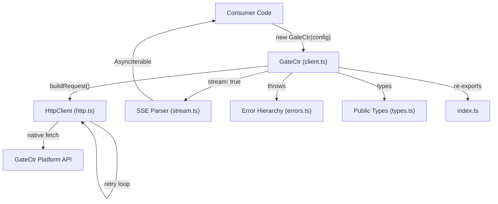

# Design Document — @gatectr/sdk Node.js SDK

## Overview

`@gatectr/sdk` is a production-grade Node.js SDK for the GateCtr platform. It provides a typed, ergonomic client that is a drop-in replacement for the OpenAI SDK — same message format, same response shape, plus GateCtr-specific metadata.

The SDK lives in `sdk-node/` as a standalone git repository, published to npm as `@gatectr/sdk`. It targets Node.js 18+ (native `fetch`), ships dual ESM/CJS output, and follows the same DevOps toolchain as the main platform.

### Key Design Goals

- Zero dependencies beyond dev tooling — native `fetch`, `AbortController`, `TextDecoder`
- Full TypeScript strict mode with no `any` in public APIs
- Transparent retry/timeout without caller boilerplate
- Streaming via `AsyncIterable<StreamChunk>` — idiomatic `for await` consumption
- API key never leaks into error messages or logs

---

## Architecture



### Module Boundaries

| Module | Responsibility |
|---|---|
| `client.ts` | `GateCtr` class — public API surface, orchestrates HTTP + stream |
| `http.ts` | `fetch` wrapper — retry loop, timeout via `AbortController`, header injection |
| `stream.ts` | SSE line parser → `AsyncIterable<StreamChunk>` |
| `errors.ts` | Error class hierarchy |
| `types.ts` | All public TypeScript interfaces and types |
| `index.ts` | Barrel re-exports |

---

## Components and Interfaces

### Directory / File Tree

```
sdk-node/
├── .github/
│   └── workflows/
│       ├── ci.yml            # lint + typecheck + test + build
│       ├── pr-checks.yml     # Conventional Commits title + conflict check
│       ├── publish.yml       # npm publish on v*.*.* tags
│       └── release.yml       # GitHub Release on v*.*.* tags
├── src/
│   ├── client.ts             # GateCtr class
│   ├── errors.ts             # Error hierarchy
│   ├── http.ts               # fetch wrapper with retry/timeout
│   ├── stream.ts             # SSE parser → AsyncIterable
│   ├── types.ts              # All public types and interfaces
│   └── index.ts              # Barrel exports
├── tests/
│   ├── client.test.ts        # Unit tests — construction, happy paths
│   ├── http.test.ts          # Unit tests — retry, timeout, backoff
│   ├── stream.test.ts        # Unit tests — SSE parsing, DONE sentinel
│   ├── errors.test.ts        # Unit tests — error classes, toJSON()
│   └── properties.test.ts    # Property-based tests (fast-check)
├── .gitignore
├── .prettierrc
├── CHANGELOG.md
├── LICENSE
├── README.md
├── commitlint.config.mjs
├── eslint.config.mjs
├── package.json
├── pnpm-lock.yaml
├── tsconfig.json             # Base config (strict, declarations)
├── tsconfig.esm.json         # ESM build → dist/esm/
├── tsconfig.cjs.json         # CJS build → dist/cjs/
└── vitest.config.ts
```

### `src/types.ts` — Public Interfaces

```typescript
// Client configuration
export interface GateCtrConfig {
  apiKey?: string;
  baseUrl?: string;       // default: "https://api.gatectr.com/v1"
  timeout?: number;       // default: 30000 ms
  maxRetries?: number;    // default: 3
  optimize?: boolean;     // default: true
  route?: boolean;        // default: false
}

// Per-request GateCtr overrides (passed in params.gatectr)
export interface PerRequestOptions {
  budgetId?: string;
  optimize?: boolean;
  route?: boolean;
}

// Shared message shape (OpenAI-compatible)
export interface Message {
  role: "system" | "user" | "assistant";
  content: string;
}

// GateCtr metadata present on every response
export interface GateCtrMetadata {
  requestId: string;
  latencyMs: number;
  overage: boolean;
  modelUsed: string;
  tokensSaved: number;
}

// Usage token counts
export interface UsageCounts {
  prompt_tokens: number;
  completion_tokens: number;
  total_tokens: number;
}

// complete() params and response
export interface CompleteParams {
  model: string;
  messages: Message[];
  max_tokens?: number;
  temperature?: number;
  gatectr?: PerRequestOptions;
  signal?: AbortSignal;
}

export interface CompleteResponse {
  id: string;
  object: "text_completion";
  model: string;
  choices: Array<{ text: string; finish_reason: string }>;
  usage: UsageCounts;
  gatectr: GateCtrMetadata;
}

// chat() params and response
export interface ChatParams {
  model: string;
  messages: Message[];
  max_tokens?: number;
  temperature?: number;
  gatectr?: PerRequestOptions;
  signal?: AbortSignal;
}

export interface ChatResponse {
  id: string;
  object: "chat.completion";
  model: string;
  choices: Array<{ message: Message; finish_reason: string }>;
  usage: UsageCounts;
  gatectr: GateCtrMetadata;
}

// stream() params and chunk shape
export interface StreamParams {
  model: string;
  messages: Message[];
  max_tokens?: number;
  temperature?: number;
  gatectr?: PerRequestOptions;
  signal?: AbortSignal;
}

export interface StreamChunk {
  id: string;
  delta: string | null;
  finishReason: string | null;
}

// models() response
export interface ModelInfo {
  modelId: string;
  displayName: string;
  provider: string;
  contextWindow: number;
  capabilities: string[];
}

export interface ModelsResponse {
  models: ModelInfo[];
  requestId: string;
}

// usage() params and response
export interface UsageParams {
  from?: string;   // YYYY-MM-DD
  to?: string;     // YYYY-MM-DD
  projectId?: string;
}

export interface UsageByProject {
  projectId: string | null;
  totalTokens: number;
  totalRequests: number;
  totalCostUsd: number;
}

export interface UsageResponse {
  totalTokens: number;
  totalRequests: number;
  totalCostUsd: number;
  savedTokens: number;
  from: string;
  to: string;
  byProject: UsageByProject[];
  budgetStatus?: Record<string, unknown>;
}
```

### `src/errors.ts` — Error Hierarchy

```typescript
export class GateCtrError extends Error {
  constructor(message: string) {
    super(message);
    this.name = "GateCtrError";
  }
}

export class GateCtrConfigError extends GateCtrError {
  constructor(message: string) {
    super(message);
    this.name = "GateCtrConfigError";
  }
}

export class GateCtrApiError extends GateCtrError {
  readonly status: number;
  readonly code: string;
  readonly requestId: string | undefined;

  constructor(opts: { message: string; status: number; code: string; requestId?: string }) { ... }

  toJSON(): { name: string; message: string; status: number; code: string; requestId: string | undefined } { ... }
}

export class GateCtrTimeoutError extends GateCtrError {
  readonly timeoutMs: number;
  constructor(timeoutMs: number) { ... }
}

export class GateCtrStreamError extends GateCtrError {
  constructor(message: string, cause?: unknown) { ... }
}

export class GateCtrNetworkError extends GateCtrError {
  constructor(message: string, cause?: unknown) { ... }
}
```

### `src/http.ts` — HTTP Client

```typescript
export interface RequestOptions {
  method: "GET" | "POST";
  url: string;
  headers: Record<string, string>;
  body?: unknown;
  signal?: AbortSignal;
  timeoutMs: number;
  maxRetries: number;
}

export interface RawResponse {
  status: number;
  headers: Headers;
  body: ReadableStream<Uint8Array> | null;
  json(): Promise<unknown>;
}

// Retryable status codes
const RETRYABLE_STATUSES = new Set([429, 500, 502, 503, 504]);
// Non-retryable status codes
const NON_RETRYABLE_STATUSES = new Set([400, 401, 403, 404]);

export async function httpRequest(opts: RequestOptions): Promise<RawResponse> { ... }

// Exponential backoff: base 500ms * 2^attempt + jitter(0-100ms)
function backoffMs(attempt: number): number { ... }
```

### `src/stream.ts` — SSE Parser

```typescript
export async function* parseSSE(
  body: ReadableStream<Uint8Array>,
  signal?: AbortSignal
): AsyncGenerator<StreamChunk> { ... }
// Reads body via TextDecoder, splits on newlines,
// parses "data: {...}" lines, yields StreamChunk,
// stops cleanly on "data: [DONE]"
```

### `src/client.ts` — GateCtr Class

```typescript
export class GateCtr {
  private readonly config: Required<GateCtrConfig>;
  private readonly baseHeaders: Record<string, string>;

  constructor(config: GateCtrConfig) { ... }
  // Validates apiKey (throws GateCtrConfigError if missing/empty)
  // Validates baseUrl (throws GateCtrConfigError if invalid URL)
  // Falls back to GATECTR_API_KEY env var
  // Strips trailing slash from baseUrl

  async complete(params: CompleteParams): Promise<CompleteResponse> { ... }
  async chat(params: ChatParams): Promise<ChatResponse> { ... }
  async stream(params: StreamParams): AsyncIterable<StreamChunk> { ... }
  async models(): Promise<ModelsResponse> { ... }
  async usage(params?: UsageParams): Promise<UsageResponse> { ... }

  private buildHeaders(extra?: Record<string, string>): Record<string, string> { ... }
  private extractMetadata(headers: Headers, body: Record<string, unknown>): GateCtrMetadata { ... }
  private mergeGatectrOptions(params: PerRequestOptions | undefined): Record<string, unknown> { ... }
}
```

### `src/index.ts` — Barrel Exports

```typescript
export { GateCtr } from "./client.js";
export {
  GateCtrError,
  GateCtrConfigError,
  GateCtrApiError,
  GateCtrTimeoutError,
  GateCtrStreamError,
  GateCtrNetworkError,
} from "./errors.js";
export type {
  GateCtrConfig,
  CompleteParams,
  CompleteResponse,
  ChatParams,
  ChatResponse,
  StreamParams,
  StreamChunk,
  ModelsResponse,
  ModelInfo,
  UsageParams,
  UsageResponse,
  GateCtrMetadata,
  PerRequestOptions,
  Message,
} from "./types.js";
```

---

## Data Models

### `package.json` — Exports Map

```json
{
  "name": "@gatectr/sdk",
  "version": "0.1.0",
  "description": "Node.js SDK for GateCtr — One gateway. Every LLM.",
  "license": "MIT",
  "engines": { "node": ">=18" },
  "type": "module",
  "main": "./dist/cjs/index.js",
  "module": "./dist/esm/index.js",
  "types": "./dist/esm/index.d.ts",
  "exports": {
    ".": {
      "import": {
        "types": "./dist/esm/index.d.ts",
        "default": "./dist/esm/index.js"
      },
      "require": {
        "types": "./dist/cjs/index.d.ts",
        "default": "./dist/cjs/index.js"
      }
    }
  },
  "files": ["dist/", "README.md"],
  "scripts": {
    "build": "pnpm clean && tsc -p tsconfig.esm.json && tsc -p tsconfig.cjs.json && node scripts/postbuild.mjs",
    "clean": "rm -rf dist *.tsbuildinfo",
    "lint": "eslint src/",
    "format": "prettier --write .",
    "test": "vitest run",
    "test:coverage": "vitest run --coverage",
    "typecheck": "tsc --noEmit",
    "prepublishOnly": "pnpm clean && pnpm build && pnpm test"
  }
}
```

### `tsconfig.json` — Base (shared strict settings)

```json
{
  "compilerOptions": {
    "target": "ES2022",
    "lib": ["ES2022"],
    "strict": true,
    "noUncheckedIndexedAccess": true,
    "exactOptionalPropertyTypes": true,
    "declaration": true,
    "declarationMap": true,
    "sourceMap": true,
    "moduleResolution": "bundler",
    "esModuleInterop": true,
    "skipLibCheck": true,
    "forceConsistentCasingInFileNames": true
  },
  "include": ["src"]
}
```

### `tsconfig.esm.json` — ESM Build

```json
{
  "extends": "./tsconfig.json",
  "compilerOptions": {
    "module": "ESNext",
    "outDir": "./dist/esm"
  }
}
```

### `tsconfig.cjs.json` — CJS Build

```json
{
  "extends": "./tsconfig.json",
  "compilerOptions": {
    "module": "CommonJS",
    "moduleResolution": "node",
    "outDir": "./dist/cjs"
  }
}
```

### `scripts/postbuild.mjs` — CJS package.json injection

```js
// Writes {"type":"commonjs"} to dist/cjs/package.json
// so Node.js resolves .js files in that directory as CJS
import { writeFileSync } from "fs";
writeFileSync("dist/cjs/package.json", JSON.stringify({ type: "commonjs" }));
```

### GitHub Actions Workflows

#### `.github/workflows/ci.yml`

```yaml
name: CI
on:
  push:
    branches: [main, develop]
  pull_request:
    branches: [main, develop]

jobs:
  lint:       # eslint src/ + prettier --check
  typecheck:  # tsc --noEmit
  test:       # vitest run --coverage (uploads to codecov)
  build:      # pnpm build (verifies dual output)
```

Node.js 18, pnpm 10. No Prisma, no DB — pure SDK CI.

#### `.github/workflows/pr-checks.yml`

```yaml
name: PR Checks
on:
  pull_request:
    types: [opened, synchronize, reopened]

jobs:
  pr-title:       # amannn/action-semantic-pull-request@v5
  conflict-check: # actions/github-script — checks pr.mergeable
```

Identical structure to the main platform's `pr-checks.yml`.

#### `.github/workflows/publish.yml`

```yaml
name: Publish to npm
on:
  push:
    tags: ['v*.*.*']

jobs:
  publish:
    # 1. Runs full CI (lint, typecheck, test, build)
    # 2. pnpm publish --access public --no-git-checks
    # Uses NODE_AUTH_TOKEN secret, registry-url: https://registry.npmjs.org
```

#### `.github/workflows/release.yml`

```yaml
name: Release
on:
  push:
    tags: ['v*.*.*']

jobs:
  create-release:
    # softprops/action-gh-release@v2
    # generate_release_notes: true
    # prerelease: true when tag contains alpha/beta/rc
```

### Retry Policy — Backoff Formula

```
delay(attempt) = min(base * 2^attempt + jitter, maxDelay)

where:
  base     = 500ms
  jitter   = random integer in [0, 100]
  maxDelay = 10_000ms (10s cap)
  attempt  = 0-indexed (0, 1, 2)

attempt 0 → ~500ms
attempt 1 → ~1000ms
attempt 2 → ~2000ms
```

Non-retryable: 400, 401, 403, 404.
Retryable: 429, 500, 502, 503, 504.
Streaming: never retried after first chunk.

### Authentication Headers

Every request includes:

```
Authorization: Bearer {apiKey}
User-Agent: @gatectr/sdk/{version} node/{process.version}
```

Every POST additionally includes:

```
Content-Type: application/json
```

The `apiKey` is stored in the `GateCtr` instance but never serialized, logged, or included in error messages. If it appears in any string context, it is replaced with `[REDACTED]`.

---

## Correctness Properties

*A property is a characteristic or behavior that should hold true across all valid executions of a system — essentially, a formal statement about what the system should do. Properties serve as the bridge between human-readable specifications and machine-verifiable correctness guarantees.*


### Property 1: Valid config construction succeeds

*For any* `GateCtrConfig` object with a non-empty `apiKey` string and a valid HTTP/HTTPS `baseUrl`, constructing a `GateCtr` client shall succeed without throwing.

**Validates: Requirements 2.1, 13.4a**

---

### Property 2: Invalid apiKey throws GateCtrConfigError

*For any* value that is an empty string, a whitespace-only string, or a non-string (null, undefined, number), passing it as `apiKey` to the `GateCtr` constructor shall throw a `GateCtrConfigError`.

**Validates: Requirements 2.2, 13.4d**

---

### Property 3: apiKey never appears in error output

*For any* `GateCtr` client constructed with any `apiKey` string, and for any operation that throws an error, the thrown error's `message`, `stack`, and `toJSON()` output shall not contain the literal `apiKey` value.

**Validates: Requirements 2.3, 8.4, 16.2**

---

### Property 4: baseUrl trailing slash is always stripped

*For any* `baseUrl` string with zero or more trailing slashes, all HTTP requests made by the client shall use a base URL with no trailing slash before the path segment is appended.

**Validates: Requirements 2.5**

---

### Property 5: All requests carry required authentication headers

*For any* request made by the `GateCtr` client (GET or POST), the outgoing HTTP request shall include `Authorization: Bearer {apiKey}`, `User-Agent: @gatectr/sdk/{version} node/{process.version}`, and — for POST requests — `Content-Type: application/json`.

**Validates: Requirements 8.1, 8.2, 8.3**

---

### Property 6: Response metadata is correctly extracted

*For any* HTTP 200 response from the Platform with any combination of `X-GateCtr-Request-Id`, `X-GateCtr-Latency-Ms`, and `X-GateCtr-Overage` headers, the `gatectr` field on the returned response object shall contain `requestId`, `latencyMs`, `overage`, `modelUsed`, and `tokensSaved` values that exactly match the header and body values.

**Validates: Requirements 3.3, 3.4, 3.5, 3.6, 3.7, 4.3**

---

### Property 7: Per-request options override client defaults

*For any* client-level `optimize` and `route` defaults, and any per-request `PerRequestOptions`, the outgoing request body shall contain the per-request values where provided, falling back to client defaults otherwise.

**Validates: Requirements 3.8, 4.4**

---

### Property 8: SSE stream chunks are correctly parsed

*For any* sequence of valid SSE `data:` lines, the `parseSSE` generator shall yield exactly one `StreamChunk` per non-`[DONE]` data line, with `delta` equal to `choices[0].delta.content` and `finishReason` equal to the chunk's `finish_reason`.

**Validates: Requirements 5.3**

---

### Property 9: Stream chunk concatenation is order-preserving

*For any* sequence of `StreamChunk` objects, concatenating all non-null `delta` values in order shall produce the same string regardless of how the original text was split across chunk boundaries — i.e., splitting a string into N chunks and streaming it yields the same assembled text as splitting it into M chunks.

**Validates: Requirements 5.3, 13.4c**

---

### Property 10: Non-2xx responses throw GateCtrApiError with correct status

*For any* HTTP response with a non-2xx status code (after retries are exhausted for retryable codes), the client shall throw a `GateCtrApiError` whose `status` field equals the HTTP status code of the response.

**Validates: Requirements 9.2, 9.3**

---

### Property 11: Retryable status codes trigger retry up to maxRetries

*For any* retryable HTTP status code (429, 500, 502, 503, 504) and any `maxRetries` value N, the client shall make exactly N+1 total HTTP attempts before throwing, where N defaults to 3.

**Validates: Requirements 10.1, 10.5**

---

### Property 12: Non-retryable status codes throw immediately

*For any* non-retryable HTTP status code (400, 401, 403, 404), the client shall throw `GateCtrApiError` on the first attempt without making any additional retry attempts.

**Validates: Requirements 10.3**

---

### Property 13: Retry backoff delays are monotonically non-decreasing

*For any* sequence of retry attempts 0, 1, 2, …, N, the base delay (excluding jitter) for attempt K shall be greater than or equal to the base delay for attempt K-1, following the formula `base * 2^attempt` with a cap at 10,000ms.

**Validates: Requirements 10.2**

---

### Property 14: CompleteResponse round-trips through JSON without data loss

*For any* `CompleteResponse` object, serializing it with `JSON.stringify` and deserializing with `JSON.parse` shall produce an object where all `gatectr` metadata fields (`requestId`, `latencyMs`, `overage`, `modelUsed`, `tokensSaved`) are preserved with their original values and types.

**Validates: Requirements 3.2, 13.4b**

---

### Property 15: Invalid baseUrl throws GateCtrConfigError

*For any* string that is not a valid HTTP or HTTPS URL (e.g., `ftp://`, `not-a-url`, empty string), passing it as `baseUrl` to the `GateCtr` constructor shall throw a `GateCtrConfigError`.

**Validates: Requirements 16.5**

---

## Error Handling

### Error Decision Tree

```
HTTP request made
│
├── fetch() throws (DNS failure, ECONNREFUSED, etc.)
│   └── throw GateCtrNetworkError
│
├── AbortController fires (timeout exceeded)
│   └── throw GateCtrTimeoutError(timeoutMs)
│
├── Response status is 2xx
│   └── parse body → return typed response
│
├── Response status is non-retryable (400, 401, 403, 404)
│   └── throw GateCtrApiError { status, code, requestId }
│
├── Response status is retryable (429, 500, 502, 503, 504)
│   ├── attempt < maxRetries → wait backoff → retry
│   └── attempt === maxRetries → throw GateCtrApiError
│
└── Streaming body errors mid-stream
    └── throw GateCtrStreamError
```

### Error Fields Reference

| Error Class | Extra Fields | Notes |
|---|---|---|
| `GateCtrError` | — | Base class, never thrown directly |
| `GateCtrConfigError` | — | Thrown synchronously at construction |
| `GateCtrApiError` | `status`, `code`, `requestId` | `toJSON()` safe for logging |
| `GateCtrTimeoutError` | `timeoutMs` | Message includes configured timeout value |
| `GateCtrStreamError` | `cause` | Wraps underlying stream error |
| `GateCtrNetworkError` | `cause` | Wraps underlying fetch error |

### Key Invariants

- The `apiKey` value is **never** interpolated into any error message. The constructor stores it in a private field; if it must appear in a string context (e.g., debug output), it is replaced with `"[REDACTED]"`.
- `GateCtrApiError.toJSON()` returns a plain object safe for `JSON.stringify` in logging pipelines — it contains `name`, `message`, `status`, `code`, and `requestId` only.
- `GateCtrConfigError` is always thrown **synchronously** at construction time, never inside a promise.
- Timeout is implemented via `AbortController` — a single controller is created per request, its signal is passed to `fetch()`, and `setTimeout` calls `controller.abort()` after `timeoutMs`. The timeout is cleared on success or non-timeout error.

---

## Testing Strategy

### Dual Testing Approach

The test suite uses two complementary strategies:

- **Unit tests** (Vitest + msw): verify specific examples, integration points, edge cases, and error conditions with deterministic inputs.
- **Property-based tests** (Vitest + fast-check): verify universal properties across hundreds of randomly generated inputs, catching edge cases that hand-written examples miss.

### Test File Layout

| File | Type | Covers |
|---|---|---|
| `tests/client.test.ts` | Unit | Construction (valid/invalid), `complete()`, `chat()`, `models()`, `usage()`, env var fallback, no-network-at-load |
| `tests/http.test.ts` | Unit | Retry count, backoff timing, timeout, non-retryable codes, header injection |
| `tests/stream.test.ts` | Unit | SSE parsing, `[DONE]` sentinel, mid-stream error, `AbortSignal` cancellation |
| `tests/errors.test.ts` | Unit | Error class hierarchy, `toJSON()` safety, `instanceof` checks |
| `tests/properties.test.ts` | Property | All 15 correctness properties above |

### msw Handler Design

```typescript
// tests/handlers.ts — reusable msw request handlers
import { http, HttpResponse } from "msw";
import { setupServer } from "msw/node";

export const handlers = [
  http.post("https://api.gatectr.com/v1/complete", () =>
    HttpResponse.json(mockCompleteResponse())
  ),
  http.post("https://api.gatectr.com/v1/chat", ({ request }) => {
    const body = await request.json();
    if (body.stream) return mockSSEResponse();
    return HttpResponse.json(mockChatResponse());
  }),
  http.get("https://api.gatectr.com/v1/models", () =>
    HttpResponse.json(mockModelsResponse())
  ),
  http.get("https://api.gatectr.com/v1/usage", () =>
    HttpResponse.json(mockUsageResponse())
  ),
];

export const server = setupServer(...handlers);
```

### fast-check Arbitraries

```typescript
// Arbitrary for valid GateCtrConfig
const validConfig = fc.record({
  apiKey: fc.string({ minLength: 1 }).filter(s => s.trim().length > 0),
  baseUrl: fc.constantFrom(
    "https://api.gatectr.com/v1",
    "https://custom.example.com/v1",
    "http://localhost:3000/v1"
  ),
  timeout: fc.integer({ min: 1000, max: 120_000 }),
  maxRetries: fc.integer({ min: 0, max: 10 }),
});

// Arbitrary for invalid apiKey values
const invalidApiKey = fc.oneof(
  fc.constant(""),
  fc.constant(null),
  fc.constant(undefined),
  fc.integer(),
  fc.string().map(s => s.replace(/\S/g, " ")), // whitespace-only
);

// Arbitrary for StreamChunk sequences
const streamChunkSeq = fc.array(
  fc.record({
    id: fc.string({ minLength: 1 }),
    delta: fc.option(fc.string(), { nil: null }),
    finishReason: fc.option(fc.string(), { nil: null }),
  }),
  { minLength: 1, maxLength: 50 }
);

// Arbitrary for CompleteResponse (for round-trip property)
const completeResponse = fc.record({
  id: fc.string({ minLength: 1 }),
  object: fc.constant("text_completion" as const),
  model: fc.string({ minLength: 1 }),
  choices: fc.array(fc.record({ text: fc.string(), finish_reason: fc.string() })),
  usage: fc.record({
    prompt_tokens: fc.nat(),
    completion_tokens: fc.nat(),
    total_tokens: fc.nat(),
  }),
  gatectr: fc.record({
    requestId: fc.string({ minLength: 1 }),
    latencyMs: fc.nat(),
    overage: fc.boolean(),
    modelUsed: fc.string({ minLength: 1 }),
    tokensSaved: fc.nat(),
  }),
});
```

### Property Test Configuration

Each property test runs a minimum of **100 iterations** (fast-check default). Tests are tagged with a comment referencing the design property they validate.

Tag format: `// Feature: sdk-node, Property {N}: {property_text}`

Example:

```typescript
// Feature: sdk-node, Property 2: Invalid apiKey throws GateCtrConfigError
it("throws GateCtrConfigError for any invalid apiKey", () => {
  fc.assert(
    fc.property(invalidApiKey, (key) => {
      expect(() => new GateCtr({ apiKey: key as string }))
        .toThrow(GateCtrConfigError);
    }),
    { numRuns: 100 }
  );
});
```

### Coverage Threshold

`vitest.config.ts` enforces 80% line coverage:

```typescript
export default defineConfig({
  test: {
    environment: "node",
    coverage: {
      provider: "v8",
      thresholds: { lines: 80, functions: 80, branches: 80 },
    },
  },
});
```

### Unit Test Balance

Unit tests focus on:
- Specific HTTP status code examples (401, 429, 500, 404)
- The `[DONE]` SSE sentinel edge case
- `AbortSignal` cancellation
- `toJSON()` output shape
- Env var fallback (`GATECTR_API_KEY`)
- No network activity at module import time

Property tests handle the broad input coverage — unit tests should not duplicate what properties already cover.

---

## Git Initialization Sequence

The `sdk-node/` directory is a **standalone git repository**, independent of the parent monorepo.

### Initialization Steps

```bash
# 1. Initialize standalone repo
cd sdk-node
git init

# 2. Stage all scaffolded files
git add .

# 3. Initial commit on main (Conventional Commits format)
git commit -m "chore: initial sdk scaffold"

# 4. Create develop branch from main
git checkout -b develop

# 5. Push both branches (once remote is configured)
git remote add origin https://github.com/GateCtr/sdk-node.git
git push -u origin main
git push -u origin develop
```

### Branch Protection Rules (GitHub)

Configure via GitHub repository settings after pushing:

| Branch | Rules |
|---|---|
| `main` | Require PR, require status checks (ci.yml), no direct push, no deletion |
| `develop` | Require PR, require status checks (ci.yml), no direct push, no deletion |

### Feature Development Flow

```
develop ──────────────────────────────────────────► develop
         \                                  /
          feat/my-feature ──────────────────
          (PR → develop, merge commit, delete branch)
```

### Release Flow

```
develop ──► PR into main ──► merge ──► tag v1.0.0 on main
                                            │
                                            ├── publish.yml → npm publish
                                            └── release.yml → GitHub Release
```

### `.gitignore` Contents

```
node_modules/
dist/
coverage/
*.tsbuildinfo
.env
.env.*
!.env.example
```