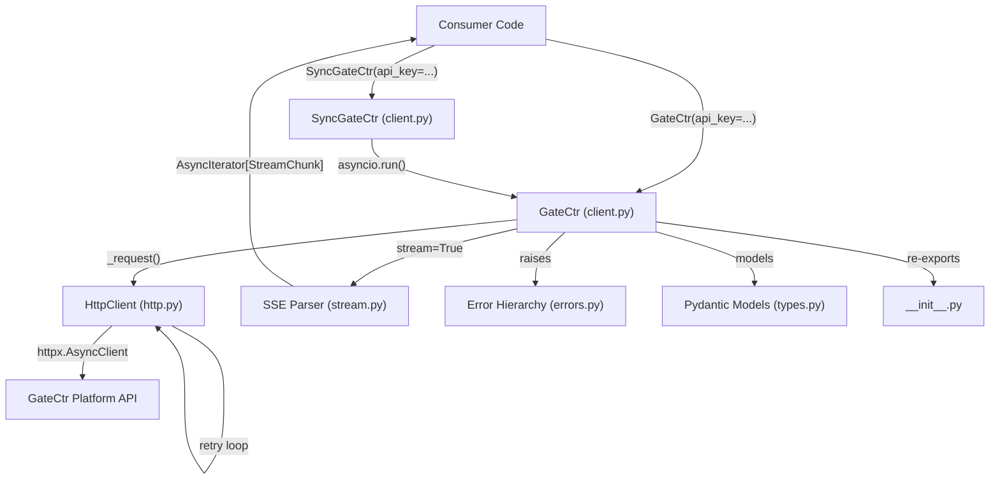

# Design Document — gatectr-sdk Python SDK

## Overview

`gatectr-sdk` is a production-grade Python SDK for the GateCtr platform. It provides a typed, async-first client for the GateCtr API that is a drop-in replacement for the OpenAI Python SDK — same message format, same response shape, plus GateCtr-specific metadata.

The SDK lives in `sdk-python/` as a standalone git repository, published to PyPI as `gatectr-sdk`. It targets Python 3.9+, uses `httpx.AsyncClient` for async HTTP, Pydantic v2 for response models, and ships a synchronous `SyncGateCtr` wrapper for non-async consumers.

### Key Design Goals

- Minimal runtime dependencies: only `httpx>=0.27` and `pydantic>=2.0`
- Full type safety: passes `mypy --strict` with zero errors
- Async-first with a synchronous wrapper via `asyncio.run()`
- Transparent retry/timeout without caller boilerplate
- Streaming via `AsyncIterator[StreamChunk]` — idiomatic `async for` consumption
- API key never leaks into exception messages, logs, or `repr()` output

---

## Architecture



### Module Boundaries

| Module | Responsibility |
|---|---|
| `client.py` | `GateCtr` class and `SyncGateCtr` wrapper — public API surface |
| `http.py` | `httpx.AsyncClient` wrapper — retry loop, timeout config, header injection |
| `stream.py` | SSE line parser → `AsyncIterator[StreamChunk]` |
| `errors.py` | Exception class hierarchy |
| `types.py` | All public Pydantic v2 models and dataclasses |
| `__init__.py` | Barrel re-exports |

---

## Components and Interfaces

### Directory / File Tree

```
sdk-python/
├── .github/
│   └── workflows/
│       ├── ci.yml            # lint + typecheck + test + build (matrix 3.9–3.12)
│       ├── pr-checks.yml     # Conventional Commits title + conflict check
│       ├── publish.yml       # PyPI publish on v*.*.* tags (OIDC)
│       └── release.yml       # GitHub Release on v*.*.* tags
├── gatectr/
│   ├── __init__.py           # Barrel exports
│   ├── client.py             # GateCtr + SyncGateCtr classes
│   ├── errors.py             # Exception hierarchy
│   ├── http.py               # httpx wrapper with retry/timeout
│   ├── stream.py             # SSE parser → AsyncIterator
│   ├── types.py              # All public Pydantic models
│   └── py.typed              # PEP 561 marker
├── tests/
│   ├── conftest.py           # pytest fixtures, respx router setup
│   ├── test_client.py        # Unit tests — construction, happy paths
│   ├── test_http.py          # Unit tests — retry, timeout, backoff
│   ├── test_stream.py        # Unit tests — SSE parsing, DONE sentinel
│   ├── test_errors.py        # Unit tests — exception classes, to_dict()
│   └── test_properties.py   # Property-based tests (hypothesis)
├── .gitignore
├── .pre-commit-config.yaml
├── CHANGELOG.md
├── LICENSE
├── README.md
└── pyproject.toml            # Single source of truth for all config
```

### `gatectr/types.py` — Pydantic v2 Models

```python
from __future__ import annotations
from typing import Literal
from pydantic import BaseModel, Field


# Per-request GateCtr overrides (passed in params.gatectr)
class PerRequestOptions(BaseModel):
    budget_id: str | None = None
    optimize: bool | None = None
    route: bool | None = None


# Shared message shape (OpenAI-compatible)
class Message(BaseModel):
    role: Literal["system", "user", "assistant"]
    content: str


# GateCtr metadata present on every response
class GateCtrMetadata(BaseModel):
    request_id: str
    latency_ms: int
    overage: bool
    model_used: str
    tokens_saved: int = 0


# Usage token counts
class UsageCounts(BaseModel):
    prompt_tokens: int
    completion_tokens: int
    total_tokens: int


# complete() models
class CompleteChoice(BaseModel):
    text: str
    finish_reason: str


class CompleteResponse(BaseModel):
    id: str
    object: Literal["text_completion"]
    model: str
    choices: list[CompleteChoice]
    usage: UsageCounts
    gatectr: GateCtrMetadata


# chat() models
class ChatChoice(BaseModel):
    message: Message
    finish_reason: str


class ChatResponse(BaseModel):
    id: str
    object: Literal["chat.completion"]
    model: str
    choices: list[ChatChoice]
    usage: UsageCounts
    gatectr: GateCtrMetadata


# stream() chunk shape
class StreamChunk(BaseModel):
    id: str
    delta: str | None
    finish_reason: str | None


# models() response
class ModelInfo(BaseModel):
    model_id: str
    display_name: str
    provider: str
    context_window: int
    capabilities: list[str]


class ModelsResponse(BaseModel):
    models: list[ModelInfo]
    request_id: str


# usage() params and response
class UsageParams(BaseModel):
    from_: str | None = Field(None, alias="from")
    to: str | None = None
    project_id: str | None = None

    model_config = {"populate_by_name": True}


class UsageByProject(BaseModel):
    project_id: str | None
    total_tokens: int
    total_requests: int
    total_cost_usd: float


class UsageResponse(BaseModel):
    total_tokens: int
    total_requests: int
    total_cost_usd: float
    saved_tokens: int
    from_: str = Field(alias="from")
    to: str
    by_project: list[UsageByProject]
    budget_status: dict | None = None

    model_config = {"populate_by_name": True}


# Client configuration — dataclass for lightweight construction
from dataclasses import dataclass, field

@dataclass
class GateCtrConfig:
    api_key: str
    base_url: str = "https://api.gatectr.com/v1"
    timeout: float = 30.0
    max_retries: int = 3
    optimize: bool = True
    route: bool = False
```

### `gatectr/errors.py` — Exception Hierarchy

```python
from __future__ import annotations


class GateCtrError(Exception):
    """Base exception for all GateCtr SDK errors."""


class GateCtrConfigError(GateCtrError):
    """Raised synchronously at construction for invalid configuration."""


class GateCtrApiError(GateCtrError):
    """Raised when the Platform returns a non-2xx HTTP response."""

    def __init__(
        self,
        message: str,
        *,
        status: int,
        code: str,
        request_id: str | None = None,
    ) -> None:
        super().__init__(message)
        self.status = status
        self.code = code
        self.request_id = request_id

    def to_dict(self) -> dict[str, object]:
        """Returns a plain dict safe for logging. Never includes api_key."""
        return {
            "name": type(self).__name__,
            "message": str(self),
            "status": self.status,
            "code": self.code,
            "request_id": self.request_id,
        }


class GateCtrTimeoutError(GateCtrError):
    """Raised when a request exceeds the configured timeout."""

    def __init__(self, timeout_s: float) -> None:
        super().__init__(f"Request timed out after {timeout_s}s")
        self.timeout_s = timeout_s


class GateCtrStreamError(GateCtrError):
    """Raised when a streaming connection fails mid-stream."""

    def __init__(self, message: str, cause: BaseException | None = None) -> None:
        super().__init__(message)
        self.__cause__ = cause


class GateCtrNetworkError(GateCtrError):
    """Raised for DNS failures, connection refused, and transport-level errors."""

    def __init__(self, message: str, cause: BaseException | None = None) -> None:
        super().__init__(message)
        self.__cause__ = cause
```

### `gatectr/http.py` — HTTP Client

The HTTP layer wraps `httpx.AsyncClient` with a retry loop and timeout configuration. A single `httpx.AsyncClient` instance is created per `GateCtr` client and reused across requests for connection pooling.

```python
from __future__ import annotations
import asyncio
import random
import httpx
from .errors import GateCtrApiError, GateCtrNetworkError, GateCtrTimeoutError

# Retryable HTTP status codes
RETRYABLE_STATUSES: frozenset[int] = frozenset({429, 500, 502, 503, 504})
# Non-retryable HTTP status codes — fail immediately
NON_RETRYABLE_STATUSES: frozenset[int] = frozenset({400, 401, 403, 404})


def backoff_seconds(attempt: int) -> float:
    """Exponential backoff: base=0.5s * 2**attempt + jitter(0–0.1s), cap 10s."""
    base = 0.5 * (2 ** attempt)
    jitter = random.uniform(0.0, 0.1)
    return min(base + jitter, 10.0)


async def http_request(
    client: httpx.AsyncClient,
    *,
    method: str,
    url: str,
    headers: dict[str, str],
    json: object | None = None,
    params: dict[str, str] | None = None,
    max_retries: int,
    stream: bool = False,
) -> httpx.Response:
    """
    Execute an HTTP request with retry logic.

    For streaming requests (stream=True), returns the response without reading
    the body — the caller is responsible for consuming and closing it.
    Streaming requests are never retried after the response headers are received.
    """
    last_exc: Exception | None = None

    for attempt in range(max_retries + 1):
        try:
            if stream:
                # Streaming: open the connection, return immediately
                # Caller must use `async with client.stream(...)` pattern
                response = await client.send(
                    client.build_request(method, url, headers=headers, json=json),
                    stream=True,
                )
                if response.status_code >= 400:
                    await response.aread()
                    _raise_for_status(response)
                return response  # never retried after headers received

            response = await client.request(
                method, url, headers=headers, json=json, params=params
            )

            if response.status_code in NON_RETRYABLE_STATUSES:
                _raise_for_status(response)

            if response.status_code in RETRYABLE_STATUSES:
                if attempt < max_retries:
                    await asyncio.sleep(backoff_seconds(attempt))
                    continue
                _raise_for_status(response)

            if response.status_code >= 400:
                _raise_for_status(response)

            return response

        except httpx.TimeoutException as exc:
            raise GateCtrTimeoutError(
                client.timeout.read or 30.0  # type: ignore[arg-type]
            ) from exc
        except httpx.NetworkError as exc:
            last_exc = exc
            if attempt < max_retries:
                await asyncio.sleep(backoff_seconds(attempt))
                continue
            raise GateCtrNetworkError(str(exc), cause=exc) from exc

    # Should not be reached, but satisfies type checker
    raise GateCtrNetworkError("All retry attempts exhausted", cause=last_exc)


def _raise_for_status(response: httpx.Response) -> None:
    body: dict[str, object] = {}
    try:
        body = response.json()
    except Exception:
        pass
    request_id = response.headers.get("X-GateCtr-Request-Id")
    code = str(body.get("code", f"http_{response.status_code}"))
    message = str(body.get("message", response.reason_phrase))
    raise GateCtrApiError(
        message, status=response.status_code, code=code, request_id=request_id
    )
```

### `gatectr/stream.py` — SSE Parser

```python
from __future__ import annotations
import json
from collections.abc import AsyncIterator
import httpx
from .errors import GateCtrStreamError
from .types import StreamChunk


async def parse_sse(response: httpx.Response) -> AsyncIterator[StreamChunk]:
    """
    Parse a server-sent events response into StreamChunk objects.

    Reads the response body line by line, parses `data: {...}` lines as JSON,
    yields StreamChunk for each non-[DONE] event, and stops cleanly on
    `data: [DONE]`.

    Raises GateCtrStreamError if the stream errors mid-flight.
    """
    try:
        async for line in response.aiter_lines():
            line = line.strip()
            if not line or not line.startswith("data:"):
                continue
            payload = line[len("data:"):].strip()
            if payload == "[DONE]":
                return
            try:
                data = json.loads(payload)
            except json.JSONDecodeError as exc:
                raise GateCtrStreamError(
                    f"Failed to parse SSE payload: {payload!r}", cause=exc
                ) from exc

            choices = data.get("choices", [])
            first = choices[0] if choices else {}
            delta_obj = first.get("delta", {})
            yield StreamChunk(
                id=data.get("id", ""),
                delta=delta_obj.get("content"),
                finish_reason=first.get("finish_reason"),
            )
    except GateCtrStreamError:
        raise
    except Exception as exc:
        raise GateCtrStreamError(f"Stream error: {exc}", cause=exc) from exc
    finally:
        await response.aclose()
```

### `gatectr/client.py` — GateCtr Class

The `GateCtr` class is the primary public interface. It stores `api_key` as a private attribute using `object.__setattr__` to keep it out of `__dict__`, and overrides `__repr__` to prevent accidental leakage.

```python
from __future__ import annotations
import asyncio
import os
import platform
import re
from collections.abc import AsyncIterator
from importlib.metadata import version
from urllib.parse import urlencode

import httpx

from .errors import GateCtrConfigError
from .http import http_request
from .stream import parse_sse
from .types import (
    ChatResponse, CompleteResponse, GateCtrMetadata,
    ModelsResponse, PerRequestOptions, StreamChunk,
    UsageParams, UsageResponse,
)

_SDK_VERSION = version("gatectr-sdk")
_PYTHON_VERSION = platform.python_version()


class GateCtr:
    """Async GateCtr client. All methods are coroutines."""

    __slots__ = ("_api_key", "_base_url", "_timeout", "_max_retries",
                 "_optimize", "_route", "_http")

    def __init__(
        self,
        api_key: str | None = None,
        *,
        base_url: str = "https://api.gatectr.com/v1",
        timeout: float = 30.0,
        max_retries: int = 3,
        optimize: bool = True,
        route: bool = False,
    ) -> None:
        resolved_key = api_key or os.environ.get("GATECTR_API_KEY", "")
        if not resolved_key or not resolved_key.strip():
            raise GateCtrConfigError(
                "api_key is required. Pass it directly or set GATECTR_API_KEY."
            )
        if not re.match(r"^https?://", base_url):
            raise GateCtrConfigError(
                f"base_url must be a valid HTTP or HTTPS URL, got: {base_url!r}"
            )
        # Store api_key outside __dict__ so it never appears in serialization
        object.__setattr__(self, "_api_key", resolved_key)
        object.__setattr__(self, "_base_url", base_url.rstrip("/"))
        object.__setattr__(self, "_timeout", timeout)
        object.__setattr__(self, "_max_retries", max_retries)
        object.__setattr__(self, "_optimize", optimize)
        object.__setattr__(self, "_route", route)
        object.__setattr__(self, "_http", httpx.AsyncClient(
            timeout=httpx.Timeout(timeout),
            headers=self._base_headers(),
        ))

    def __repr__(self) -> str:
        return (
            f"GateCtr(base_url={self._base_url!r}, "
            f"api_key='[REDACTED]', max_retries={self._max_retries})"
        )

    def _base_headers(self) -> dict[str, str]:
        return {
            "Authorization": f"Bearer {self._api_key}",
            "User-Agent": f"gatectr-sdk/{_SDK_VERSION} python/{_PYTHON_VERSION}",
        }

    def _merge_gatectr_opts(
        self, per_request: PerRequestOptions | None
    ) -> dict[str, object]:
        opts: dict[str, object] = {
            "optimize": self._optimize,
            "route": self._route,
        }
        if per_request:
            if per_request.optimize is not None:
                opts["optimize"] = per_request.optimize
            if per_request.route is not None:
                opts["route"] = per_request.route
            if per_request.budget_id is not None:
                opts["budget_id"] = per_request.budget_id
        return opts

    @staticmethod
    def _extract_metadata(
        response: httpx.Response, body: dict[str, object]
    ) -> GateCtrMetadata:
        usage = body.get("usage") or {}
        return GateCtrMetadata(
            request_id=response.headers.get("X-GateCtr-Request-Id", ""),
            latency_ms=int(response.headers.get("X-GateCtr-Latency-Ms", 0)),
            overage=response.headers.get("X-GateCtr-Overage", "").lower() == "true",
            model_used=str(body.get("model", "")),
            tokens_saved=int(usage.get("saved_tokens", 0)),  # type: ignore[arg-type]
        )

    async def complete(
        self,
        model: str,
        messages: list[dict[str, str]],
        *,
        max_tokens: int | None = None,
        temperature: float | None = None,
        gatectr: PerRequestOptions | None = None,
    ) -> CompleteResponse:
        body: dict[str, object] = {
            "model": model,
            "messages": messages,
            "stream": False,
            **self._merge_gatectr_opts(gatectr),
        }
        if max_tokens is not None:
            body["max_tokens"] = max_tokens
        if temperature is not None:
            body["temperature"] = temperature

        resp = await http_request(
            self._http,
            method="POST",
            url=f"{self._base_url}/complete",
            headers={"Content-Type": "application/json"},
            json=body,
            max_retries=self._max_retries,
        )
        data: dict[str, object] = resp.json()
        data["gatectr"] = self._extract_metadata(resp, data).model_dump()
        return CompleteResponse.model_validate(data)

    async def chat(
        self,
        model: str,
        messages: list[dict[str, str]],
        *,
        max_tokens: int | None = None,
        temperature: float | None = None,
        gatectr: PerRequestOptions | None = None,
    ) -> ChatResponse:
        body: dict[str, object] = {
            "model": model,
            "messages": messages,
            "stream": False,
            **self._merge_gatectr_opts(gatectr),
        }
        if max_tokens is not None:
            body["max_tokens"] = max_tokens
        if temperature is not None:
            body["temperature"] = temperature

        resp = await http_request(
            self._http,
            method="POST",
            url=f"{self._base_url}/chat",
            headers={"Content-Type": "application/json"},
            json=body,
            max_retries=self._max_retries,
        )
        data: dict[str, object] = resp.json()
        data["gatectr"] = self._extract_metadata(resp, data).model_dump()
        return ChatResponse.model_validate(data)

    async def stream(
        self,
        model: str,
        messages: list[dict[str, str]],
        *,
        max_tokens: int | None = None,
        temperature: float | None = None,
        gatectr: PerRequestOptions | None = None,
    ) -> AsyncIterator[StreamChunk]:
        body: dict[str, object] = {
            "model": model,
            "messages": messages,
            "stream": True,
            **self._merge_gatectr_opts(gatectr),
        }
        if max_tokens is not None:
            body["max_tokens"] = max_tokens
        if temperature is not None:
            body["temperature"] = temperature

        resp = await http_request(
            self._http,
            method="POST",
            url=f"{self._base_url}/chat",
            headers={"Content-Type": "application/json"},
            json=body,
            max_retries=self._max_retries,
            stream=True,
        )
        return parse_sse(resp)

    async def models(self) -> ModelsResponse:
        resp = await http_request(
            self._http,
            method="GET",
            url=f"{self._base_url}/models",
            headers={},
            max_retries=self._max_retries,
        )
        data: dict[str, object] = resp.json()
        data["request_id"] = resp.headers.get("X-GateCtr-Request-Id", "")
        return ModelsResponse.model_validate(data)

    async def usage(self, params: UsageParams | None = None) -> UsageResponse:
        query: dict[str, str] = {}
        if params:
            if params.from_:
                query["from"] = params.from_
            if params.to:
                query["to"] = params.to
            if params.project_id:
                query["project_id"] = params.project_id

        resp = await http_request(
            self._http,
            method="GET",
            url=f"{self._base_url}/usage",
            headers={},
            params=query or None,
            max_retries=self._max_retries,
        )
        return UsageResponse.model_validate(resp.json())

    async def aclose(self) -> None:
        await self._http.aclose()

    async def __aenter__(self) -> "GateCtr":
        return self

    async def __aexit__(self, *_: object) -> None:
        await self.aclose()
```

### `SyncGateCtr` — Synchronous Wrapper

`SyncGateCtr` lives in `client.py` alongside `GateCtr`. It wraps every async method with `asyncio.run()`, creating and tearing down an event loop per call. This is intentionally simple — it is not suitable for use inside an already-running event loop (e.g., Jupyter notebooks), where callers should use `GateCtr` directly.

```python
import asyncio
from collections.abc import Iterator
from .types import (
    ChatResponse, CompleteResponse, ModelsResponse,
    PerRequestOptions, StreamChunk, UsageParams, UsageResponse,
)


class SyncGateCtr:
    """Synchronous wrapper over GateCtr. Uses asyncio.run() per call."""

    def __init__(self, api_key: str | None = None, **kwargs: object) -> None:
        self._async = GateCtr(api_key, **kwargs)  # type: ignore[arg-type]

    def __repr__(self) -> str:
        return repr(self._async).replace("GateCtr(", "SyncGateCtr(", 1)

    def complete(self, model: str, messages: list[dict[str, str]], **kwargs: object) -> CompleteResponse:
        return asyncio.run(self._async.complete(model, messages, **kwargs))  # type: ignore[arg-type]

    def chat(self, model: str, messages: list[dict[str, str]], **kwargs: object) -> ChatResponse:
        return asyncio.run(self._async.chat(model, messages, **kwargs))  # type: ignore[arg-type]

    def stream(self, model: str, messages: list[dict[str, str]], **kwargs: object) -> Iterator[StreamChunk]:
        """Synchronous streaming via a dedicated event loop."""
        async def _collect() -> list[StreamChunk]:
            chunks: list[StreamChunk] = []
            async for chunk in await self._async.stream(model, messages, **kwargs):  # type: ignore[arg-type]
                chunks.append(chunk)
            return chunks
        yield from asyncio.run(_collect())

    def models(self) -> ModelsResponse:
        return asyncio.run(self._async.models())

    def usage(self, params: UsageParams | None = None) -> UsageResponse:
        return asyncio.run(self._async.usage(params))
```

### `gatectr/__init__.py` — Barrel Exports

```python
from .client import GateCtr, SyncGateCtr
from .errors import (
    GateCtrError,
    GateCtrConfigError,
    GateCtrApiError,
    GateCtrTimeoutError,
    GateCtrStreamError,
    GateCtrNetworkError,
)
from .types import (
    GateCtrMetadata,
    Message,
    PerRequestOptions,
    CompleteResponse,
    ChatResponse,
    StreamChunk,
    ModelInfo,
    ModelsResponse,
    UsageParams,
    UsageResponse,
    UsageCounts,
    UsageByProject,
)

__all__ = [
    "GateCtr",
    "SyncGateCtr",
    "GateCtrError",
    "GateCtrConfigError",
    "GateCtrApiError",
    "GateCtrTimeoutError",
    "GateCtrStreamError",
    "GateCtrNetworkError",
    "GateCtrMetadata",
    "Message",
    "PerRequestOptions",
    "CompleteResponse",
    "ChatResponse",
    "StreamChunk",
    "ModelInfo",
    "ModelsResponse",
    "UsageParams",
    "UsageResponse",
    "UsageCounts",
    "UsageByProject",
]
```

---

## Data Models

### `pyproject.toml` — Single Source of Truth

```toml
[build-system]
requires = ["hatchling"]
build-backend = "hatchling.build"

[project]
name = "gatectr-sdk"
version = "0.1.0"
description = "Python SDK for GateCtr — One gateway. Every LLM."
readme = "README.md"
license = { text = "MIT" }
requires-python = ">=3.9"
dependencies = [
    "httpx>=0.27",
    "pydantic>=2.0",
]

[project.urls]
Homepage = "https://gatectr.com"
Repository = "https://github.com/GateCtr/sdk-python"
Changelog = "https://github.com/GateCtr/sdk-python/blob/main/CHANGELOG.md"

[tool.hatch.build.targets.wheel]
packages = ["gatectr"]

[tool.hatch.envs.default]
dependencies = [
    "pytest>=8.0",
    "pytest-asyncio>=0.23",
    "pytest-cov>=5.0",
    "respx>=0.21",
    "hypothesis>=6.100",
    "mypy>=1.10",
    "ruff>=0.4",
]

[tool.hatch.envs.default.scripts]
test = "pytest"
test-cov = "pytest --cov=gatectr --cov-report=term-missing --cov-fail-under=80"
lint = "ruff check gatectr/ tests/"
format = "ruff format gatectr/ tests/"
typecheck = "mypy gatectr/"
build = "hatch build"
clean = "rm -rf dist/ *.egg-info .mypy_cache .ruff_cache __pycache__"

[tool.pytest.ini_options]
asyncio_mode = "auto"
testpaths = ["tests"]

[tool.coverage.run]
source = ["gatectr"]

[tool.mypy]
strict = true
python_version = "3.9"

[tool.ruff]
target-version = "py39"
line-length = 100

[tool.ruff.lint]
select = [
    "E",   # pycodestyle errors
    "W",   # pycodestyle warnings
    "F",   # pyflakes
    "I",   # isort
    "UP",  # pyupgrade
    "B",   # flake8-bugbear
    "C4",  # flake8-comprehensions
    "SIM", # flake8-simplify
]
ignore = ["E501"]  # line length handled by formatter

[tool.ruff.lint.isort]
known-first-party = ["gatectr"]
```

### GitHub Actions Workflows

#### `.github/workflows/ci.yml`

```yaml
name: CI
on:
  push:
    branches: [main, develop]
  pull_request:
    branches: [main, develop]

jobs:
  test:
    name: "Python ${{ matrix.python-version }}"
    runs-on: ubuntu-latest
    strategy:
      fail-fast: false
      matrix:
        python-version: ["3.9", "3.10", "3.11", "3.12"]
    steps:
      - uses: actions/checkout@v4
      - uses: actions/setup-python@v5
        with:
          python-version: ${{ matrix.python-version }}
      - run: pip install hatch
      - run: hatch run lint
      - run: hatch run typecheck
      - run: hatch run test-cov
      - run: hatch build
```

#### `.github/workflows/pr-checks.yml`

```yaml
name: PR Checks
on:
  pull_request:
    types: [opened, synchronize, reopened]

jobs:
  pr-title:
    runs-on: ubuntu-latest
    steps:
      - uses: amannn/action-semantic-pull-request@v5
        env:
          GITHUB_TOKEN: ${{ secrets.GITHUB_TOKEN }}

  conflict-check:
    runs-on: ubuntu-latest
    steps:
      - uses: actions/github-script@v7
        with:
          script: |
            const pr = await github.rest.pulls.get({
              owner: context.repo.owner,
              repo: context.repo.repo,
              pull_number: context.issue.number,
            });
            if (pr.data.mergeable === false) {
              core.setFailed("PR has merge conflicts.");
            }
```

#### `.github/workflows/publish.yml`

```yaml
name: Publish to PyPI
on:
  push:
    tags: ["v*.*.*"]

permissions:
  id-token: write  # Required for OIDC Trusted Publisher

jobs:
  publish:
    runs-on: ubuntu-latest
    environment: pypi
    steps:
      - uses: actions/checkout@v4
      - uses: actions/setup-python@v5
        with:
          python-version: "3.11"
      - run: pip install hatch
      - run: hatch run lint
      - run: hatch run typecheck
      - run: hatch run test-cov
      - run: hatch build
      - uses: pypa/gh-action-pypi-publish@release/v1
        # Uses OIDC Trusted Publisher — no PYPI_API_TOKEN needed
        # Configure at: https://pypi.org/manage/account/publishing/
```

#### `.github/workflows/release.yml`

```yaml
name: Release
on:
  push:
    tags: ["v*.*.*"]

jobs:
  create-release:
    runs-on: ubuntu-latest
    permissions:
      contents: write
    steps:
      - uses: actions/checkout@v4
      - uses: softprops/action-gh-release@v2
        with:
          generate_release_notes: true
          prerelease: ${{ contains(github.ref_name, 'alpha') || contains(github.ref_name, 'beta') || contains(github.ref_name, 'rc') }}
```

### Retry Policy — Backoff Formula

```
delay(attempt) = min(base * 2**attempt + jitter, max_delay)

where:
  base      = 0.5s
  jitter    = random float in [0.0, 0.1)
  max_delay = 10.0s
  attempt   = 0-indexed (0, 1, 2)

attempt 0 → ~0.5s
attempt 1 → ~1.0s
attempt 2 → ~2.0s
```

Non-retryable: 400, 401, 403, 404.
Retryable: 429, 500, 502, 503, 504.
Streaming: never retried after response headers are received.

### Authentication Headers

Every request includes:

```
Authorization: Bearer {api_key}
User-Agent: gatectr-sdk/{version} python/{python_version}
```

Every POST additionally includes:

```
Content-Type: application/json
```

The `api_key` is stored via `object.__setattr__` into a slot named `_api_key`, keeping it out of `__dict__`. The `__repr__` method replaces it with `'[REDACTED]'`. If the literal key value ever appears in an exception message, it is replaced with `"[REDACTED]"` before raising.

### api_key Security: Private Attribute Pattern

```python
# Stored outside __dict__ using __slots__ + object.__setattr__
__slots__ = ("_api_key", ...)

# Construction
object.__setattr__(self, "_api_key", resolved_key)

# __repr__ never exposes the key
def __repr__(self) -> str:
    return f"GateCtr(base_url={self._base_url!r}, api_key='[REDACTED]', ...)"

# Verification: vars(client) returns {} — api_key is not in __dict__
assert "_api_key" not in vars(client)
```

---

## Correctness Properties

*A property is a characteristic or behavior that should hold true across all valid executions of a system — essentially, a formal statement about what the system should do. Properties serve as the bridge between human-readable specifications and machine-verifiable correctness guarantees.*

### Property 1: Valid configuration construction succeeds

*For any* combination of a non-empty, non-whitespace `api_key` string, a valid HTTP/HTTPS `base_url`, a positive `timeout`, a non-negative `max_retries`, and boolean `optimize`/`route` flags, constructing a `GateCtr` client shall succeed without raising.

**Validates: Requirements 2.1, 13.4a**

---

### Property 2: Invalid api_key raises GateCtrConfigError

*For any* value that is an empty string or a whitespace-only string passed as `api_key` (with no `GATECTR_API_KEY` env var set), constructing a `GateCtr` client shall raise `GateCtrConfigError` synchronously.

**Validates: Requirements 2.2, 13.4d**

---

### Property 3: api_key never appears in any output

*For any* `GateCtr` client constructed with any `api_key` string, the `repr()` of the client, the string representation of any raised exception, and the output of `GateCtrApiError.to_dict()` shall not contain the literal `api_key` value. Additionally, `vars(client)` shall not contain a key whose value equals the `api_key`.

**Validates: Requirements 8.4, 16.2, 16.6**

---

### Property 4: base_url trailing slash is always stripped

*For any* `base_url` string with zero or more trailing slashes, all HTTP requests made by the client shall target a URL where the base has no trailing slash before the path segment is appended.

**Validates: Requirements 2.5**

---

### Property 5: Invalid base_url raises GateCtrConfigError

*For any* string that is not a valid HTTP or HTTPS URL (e.g., `ftp://`, `not-a-url`, empty string, `//no-scheme`), passing it as `base_url` to the `GateCtr` constructor shall raise `GateCtrConfigError` synchronously.

**Validates: Requirements 2.6, 16.5**

---

### Property 6: All requests carry required authentication and User-Agent headers

*For any* request made by the `GateCtr` client (GET or POST), the outgoing HTTP request shall include `Authorization: Bearer {api_key}` and `User-Agent: gatectr-sdk/{version} python/{python_version}`. For POST requests, it shall additionally include `Content-Type: application/json`.

**Validates: Requirements 8.1, 8.2, 8.3**

---

### Property 7: GateCtr metadata is correctly extracted from response headers and body

*For any* HTTP 200 response with any combination of `X-GateCtr-Request-Id`, `X-GateCtr-Latency-Ms`, and `X-GateCtr-Overage` headers and any `model` and `usage.saved_tokens` values in the body, the `gatectr` field on the returned Pydantic model shall contain `request_id`, `latency_ms`, `overage`, `model_used`, and `tokens_saved` values that exactly match the header and body values, with `tokens_saved` defaulting to `0` when absent.

**Validates: Requirements 3.3, 3.4, 3.5, 3.6, 3.7, 4.3**

---

### Property 8: Per-request options override client-level defaults

*For any* client-level `optimize` and `route` defaults, and any `PerRequestOptions` passed per-call, the outgoing request body shall contain the per-request values where provided, falling back to client-level defaults otherwise.

**Validates: Requirements 3.8, 4.4**

---

### Property 9: SSE stream chunks are correctly parsed and order-preserving

*For any* sequence of valid SSE `data:` lines, the `parse_sse` generator shall yield exactly one `StreamChunk` per non-`[DONE]` data line with `delta` equal to `choices[0].delta.content`. Furthermore, concatenating all non-`None` `delta` values in yield order shall produce the same string regardless of how the original text was split across chunk boundaries.

**Validates: Requirements 5.2, 5.3, 13.4c**

---

### Property 10: Non-2xx responses raise GateCtrApiError with correct status

*For any* HTTP response with a non-2xx status code (after retries are exhausted for retryable codes), the client shall raise a `GateCtrApiError` whose `status` attribute equals the HTTP status code of the response.

**Validates: Requirements 9.2, 9.3**

---

### Property 11: Retryable status codes trigger retry up to max_retries; non-retryable codes do not retry

*For any* retryable HTTP status code (429, 500, 502, 503, 504) and any `max_retries` value N, the client shall make exactly N+1 total HTTP attempts before raising. *For any* non-retryable HTTP status code (400, 401, 403, 404), the client shall raise `GateCtrApiError` on the first attempt without any additional retry attempts.

**Validates: Requirements 10.1, 10.3, 10.5**

---

### Property 12: Retry backoff delays are monotonically non-decreasing

*For any* sequence of retry attempts 0, 1, 2, …, N, the base delay (excluding jitter) for attempt K shall be greater than or equal to the base delay for attempt K-1, following the formula `0.5 * 2**attempt` with a cap at 10.0 seconds.

**Validates: Requirements 10.2**

---

### Property 13: CompleteResponse round-trips through Pydantic JSON serialization without data loss

*For any* `CompleteResponse` object, calling `model.model_dump_json()` and then `CompleteResponse.model_validate_json()` shall produce an object where all `gatectr` metadata fields (`request_id`, `latency_ms`, `overage`, `model_used`, `tokens_saved`) are preserved with their original values and types.

**Validates: Requirements 3.2, 13.4b**

---

### Property 14: GateCtrApiError.to_dict() is safe for logging

*For any* `GateCtrApiError` instance constructed with any `status`, `code`, `request_id`, and `message`, calling `to_dict()` shall return a plain `dict` containing exactly the keys `name`, `message`, `status`, `code`, and `request_id`, with no key whose value equals the client's `api_key`.

**Validates: Requirements 9.6**

---

### Property 15: usage() query parameters are correctly forwarded

*For any* `UsageParams` with any combination of `from_`, `to`, and `project_id` values, the outgoing GET request to `/usage` shall include exactly those values as query parameters, with `from_` serialized as the key `from`, and omit parameters that are `None`.

**Validates: Requirements 7.1, 7.3**

---

## Error Handling

### Error Decision Tree

```
HTTP request made
│
├── httpx raises NetworkError (DNS, ECONNREFUSED, etc.)
│   └── raise GateCtrNetworkError
│
├── httpx raises TimeoutException
│   └── raise GateCtrTimeoutError(timeout_s)
│
├── Response status is 2xx
│   └── parse body → return Pydantic model
│
├── Response status is non-retryable (400, 401, 403, 404)
│   └── raise GateCtrApiError { status, code, request_id }
│
├── Response status is retryable (429, 500, 502, 503, 504)
│   ├── attempt < max_retries → asyncio.sleep(backoff) → retry
│   └── attempt == max_retries → raise GateCtrApiError
│
└── Streaming body errors mid-stream
    └── raise GateCtrStreamError
```

### Error Fields Reference

| Exception Class | Extra Attributes | Notes |
|---|---|---|
| `GateCtrError` | — | Base class, never raised directly |
| `GateCtrConfigError` | — | Raised synchronously at construction |
| `GateCtrApiError` | `status`, `code`, `request_id` | `to_dict()` safe for logging |
| `GateCtrTimeoutError` | `timeout_s` | Message includes configured timeout value |
| `GateCtrStreamError` | `__cause__` | Wraps underlying stream error |
| `GateCtrNetworkError` | `__cause__` | Wraps underlying httpx error |

### Key Invariants

- The `api_key` value is **never** interpolated into any exception message. If it must appear in a string context, it is replaced with `"[REDACTED]"`.
- `GateCtrApiError.to_dict()` returns a plain `dict` safe for `json.dumps()` in logging pipelines — it contains only `name`, `message`, `status`, `code`, and `request_id`.
- `GateCtrConfigError` is always raised **synchronously** at construction time, never inside a coroutine.
- Timeout is implemented via `httpx.Timeout` configured on the `AsyncClient` — no manual `asyncio.wait_for` wrapping needed. `httpx` raises `httpx.TimeoutException` which the HTTP layer converts to `GateCtrTimeoutError`.
- The `httpx.AsyncClient` instance is created once at construction and reused for connection pooling. It is closed via `aclose()` or the async context manager protocol.

---

## Testing Strategy

### Dual Testing Approach

The test suite uses two complementary strategies:

- **Unit tests** (`pytest` + `respx`): verify specific examples, integration points, edge cases, and error conditions with deterministic inputs.
- **Property-based tests** (`pytest` + `hypothesis`): verify universal properties across hundreds of randomly generated inputs, catching edge cases that hand-written examples miss.

### Test File Layout

| File | Type | Covers |
|---|---|---|
| `tests/test_client.py` | Unit | Construction (valid/invalid), `complete()`, `chat()`, `models()`, `usage()`, env var fallback, no-network-at-import |
| `tests/test_http.py` | Unit | Retry count, backoff timing, timeout, non-retryable codes, header injection |
| `tests/test_stream.py` | Unit | SSE parsing, `[DONE]` sentinel, mid-stream error, `aclose()` cancellation |
| `tests/test_errors.py` | Unit | Exception class hierarchy, `to_dict()` safety, `isinstance` checks |
| `tests/test_properties.py` | Property | All 15 correctness properties above |

### respx Handler Design

```python
# tests/conftest.py — reusable respx router and fixtures
import pytest
import respx
import httpx

BASE = "https://api.gatectr.com/v1"

@pytest.fixture
def mock_api():
    with respx.mock(base_url=BASE, assert_all_called=False) as router:
        router.post("/complete").mock(return_value=httpx.Response(
            200,
            json=mock_complete_body(),
            headers={"X-GateCtr-Request-Id": "req_test123",
                     "X-GateCtr-Latency-Ms": "42"},
        ))
        router.post("/chat").mock(return_value=httpx.Response(
            200, json=mock_chat_body(),
            headers={"X-GateCtr-Request-Id": "req_test456"},
        ))
        router.get("/models").mock(return_value=httpx.Response(
            200, json=mock_models_body(),
            headers={"X-GateCtr-Request-Id": "req_models"},
        ))
        router.get("/usage").mock(return_value=httpx.Response(
            200, json=mock_usage_body(),
        ))
        yield router
```

### Hypothesis Strategies

```python
from hypothesis import given, settings
from hypothesis import strategies as st

# Strategy for valid api_key values
valid_api_key = st.text(min_size=1).filter(lambda s: s.strip() != "")

# Strategy for invalid api_key values (empty or whitespace-only)
invalid_api_key = st.one_of(
    st.just(""),
    st.text(alphabet=" \t\n\r", min_size=1),  # whitespace-only
)

# Strategy for valid base_url values
valid_base_url = st.sampled_from([
    "https://api.gatectr.com/v1",
    "https://custom.example.com/v1",
    "http://localhost:3000/v1",
    "https://api.gatectr.com/v1/",   # trailing slash — must be stripped
    "https://api.gatectr.com/v1///", # multiple trailing slashes
])

# Strategy for invalid base_url values
invalid_base_url = st.one_of(
    st.just(""),
    st.just("ftp://example.com"),
    st.just("not-a-url"),
    st.just("//no-scheme"),
    st.text(max_size=20).filter(lambda s: not s.startswith(("http://", "https://"))),
)

# Strategy for GateCtrMetadata-equivalent header dicts
metadata_headers = st.fixed_dictionaries({
    "X-GateCtr-Request-Id": st.text(min_size=1, max_size=64),
    "X-GateCtr-Latency-Ms": st.integers(min_value=0, max_value=60_000).map(str),
    "X-GateCtr-Overage": st.sampled_from(["true", "false", ""]),
})

# Strategy for StreamChunk sequences
stream_chunk_seq = st.lists(
    st.fixed_dictionaries({
        "id": st.text(min_size=1, max_size=32),
        "delta": st.one_of(st.none(), st.text(max_size=100)),
        "finish_reason": st.one_of(st.none(), st.just("stop"), st.just("length")),
    }),
    min_size=1,
    max_size=50,
)

# Strategy for CompleteResponse-equivalent dicts (for round-trip property)
complete_response_dict = st.fixed_dictionaries({
    "id": st.text(min_size=1),
    "object": st.just("text_completion"),
    "model": st.text(min_size=1),
    "choices": st.lists(st.fixed_dictionaries({
        "text": st.text(),
        "finish_reason": st.just("stop"),
    }), min_size=1),
    "usage": st.fixed_dictionaries({
        "prompt_tokens": st.integers(min_value=0),
        "completion_tokens": st.integers(min_value=0),
        "total_tokens": st.integers(min_value=0),
    }),
    "gatectr": st.fixed_dictionaries({
        "request_id": st.text(min_size=1),
        "latency_ms": st.integers(min_value=0),
        "overage": st.booleans(),
        "model_used": st.text(min_size=1),
        "tokens_saved": st.integers(min_value=0),
    }),
})
```

### Property Test Configuration

Each property test runs a minimum of **100 iterations** (Hypothesis default). Tests are tagged with a comment referencing the design property they validate.

Tag format: `# Feature: sdk-python, Property {N}: {property_text}`

Example:

```python
# Feature: sdk-python, Property 2: Invalid api_key raises GateCtrConfigError
@given(api_key=invalid_api_key)
@settings(max_examples=100)
def test_invalid_api_key_raises(api_key: str, monkeypatch: pytest.MonkeyPatch) -> None:
    monkeypatch.delenv("GATECTR_API_KEY", raising=False)
    with pytest.raises(GateCtrConfigError):
        GateCtr(api_key=api_key)
```

### Coverage Threshold

`pyproject.toml` enforces 80% line coverage via `pytest-cov`:

```toml
[tool.hatch.envs.default.scripts]
test-cov = "pytest --cov=gatectr --cov-report=term-missing --cov-fail-under=80"
```

### Unit Test Balance

Unit tests focus on:
- Specific HTTP status code examples (401, 429, 500, 404)
- The `[DONE]` SSE sentinel edge case
- `aclose()` / context manager cleanup
- `to_dict()` output shape
- Env var fallback (`GATECTR_API_KEY`)
- No network activity at module import time
- `SyncGateCtr` delegates correctly to `GateCtr`

Property tests handle broad input coverage — unit tests should not duplicate what properties already cover.

---

## Git Initialization Sequence

The `sdk-python/` directory is a **standalone git repository**, independent of the parent monorepo.

### Initialization Steps

```bash
# 1. Initialize standalone repo
cd sdk-python
git init

# 2. Stage all scaffolded files
git add .

# 3. Initial commit on main (Conventional Commits format)
git commit -m "chore: initial sdk scaffold"

# 4. Create develop branch from main
git checkout -b develop

# 5. Push both branches (once remote is configured)
git remote add origin https://github.com/GateCtr/sdk-python.git
git push -u origin main
git push -u origin develop
```

### Branch Protection Rules (GitHub)

| Branch | Rules |
|---|---|
| `main` | Require PR, require status checks (ci.yml), no direct push, no deletion |
| `develop` | Require PR, require status checks (ci.yml), no direct push, no deletion |

### Release Flow

```
develop ──► PR into main ──► merge ──► tag v1.0.0 on main
                                            │
                                            ├── publish.yml → PyPI publish (OIDC)
                                            └── release.yml → GitHub Release
```

### `.gitignore` Contents

```
__pycache__/
*.pyc
*.pyo
*.pyd
dist/
*.egg-info/
.venv/
venv/
coverage/
.coverage
.mypy_cache/
.ruff_cache/
.env
.env.*
!.env.example
```
