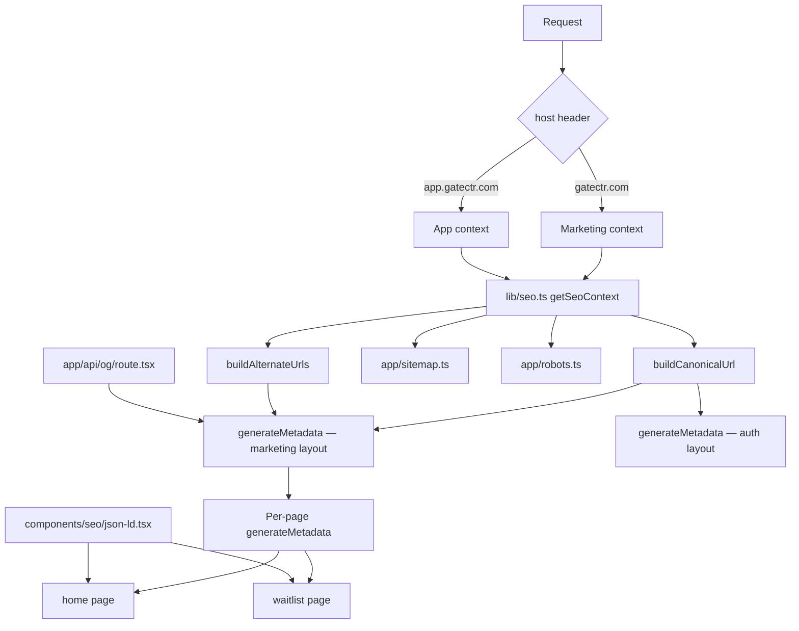

# Design Document: seo-complete

## Overview

This feature implements production-grade SEO for GateCtr — a Next.js 16 App Router application with next-intl 4 bilingual support (EN default, FR with `/fr/` prefix) and subdomain-split routing (`gatectr.com` for marketing, `app.gatectr.com` for the app).

The design covers: per-page metadata with i18n, Open Graph / Twitter Cards, canonical URLs, hreflang alternates, JSON-LD structured data, sitemap.xml, robots.txt, PWA manifest, a dynamic OG image endpoint, and the translation keys that back all of it.

The central challenge is **subdomain-awareness**: the same Next.js codebase serves two domains with completely different SEO requirements. A shared utility (`lib/seo.ts`) reads the `host` request header at runtime to resolve the correct base URLs and robots directives, and every metadata generator, sitemap, and robots handler consumes that context.

---

## Architecture



**Key design decisions:**

- `lib/seo.ts` is the single source of truth for URL construction. All other files import from it — no URL strings are duplicated.
- `getSeoContext()` uses `next/headers` to read the `host` header server-side. This works in Server Components, `generateMetadata`, Route Handlers, and `sitemap.ts` / `robots.ts`.
- The sitemap and robots files use Next.js file-based conventions (`app/sitemap.ts`, `app/robots.ts`) which are automatically served at `/sitemap.xml` and `/robots.txt`.
- JSON-LD is rendered as a React Server Component (`<JsonLd>`) that emits a `<script type="application/ld+json">` tag — no third-party library needed.
- The OG image endpoint (`app/api/og/route.tsx`) uses Next.js `ImageResponse` from `next/og`.

---

## Components and Interfaces

### `lib/seo.ts`

```typescript
export interface SeoContext {
  marketingUrl: string; // e.g. "https://gatectr.com"
  appUrl: string; // e.g. "https://app.gatectr.com"
  isAppSubdomain: boolean;
}

// Reads host header via next/headers — call only in Server Components / Route Handlers
export async function getSeoContext(): Promise<SeoContext>;

// Builds the canonical URL for a given path and locale
// path: the route path without locale prefix, e.g. "/" or "/waitlist"
// locale: "en" | "fr"
// context: from getSeoContext()
export function buildCanonicalUrl(
  path: string,
  locale: string,
  context: SeoContext,
): string;

// Returns { en: string, fr: string, xDefault: string } for hreflang
// Only meaningful for marketing pages
export function buildAlternateUrls(
  path: string,
  context: SeoContext,
): { en: string; fr: string; xDefault: string };
```

**URL construction rules:**

- Marketing EN: `{marketingUrl}{path}` (no locale prefix, path is `/` or `/waitlist`)
- Marketing FR: `{marketingUrl}/fr{path}`
- App pages: `{appUrl}/{locale-prefix}{path}` (locale prefix only for FR)
- Fallbacks: `NEXT_PUBLIC_MARKETING_URL ?? "https://gatectr.com"`, `NEXT_PUBLIC_APP_URL ?? "https://app.gatectr.com"`

---

### `app/sitemap.ts`

Next.js `MetadataRoute.Sitemap` export. Reads `SeoContext` to detect subdomain.

- On app subdomain: returns `[]` (Next.js will 404 an empty sitemap)
- On marketing subdomain: returns entries for `/` and `/waitlist`, each with both locale alternates

```typescript
// Entry shape per URL:
{
  url: string,           // canonical EN URL
  lastModified: Date,    // build date
  changeFrequency: 'weekly' | 'monthly',
  priority: 1.0 | 0.8,
  alternates: {
    languages: {
      en: string,
      fr: string,
    }
  }
}
```

---

### `app/robots.ts`

Next.js `MetadataRoute.Robots` export. Two variants based on subdomain:

**Marketing (`gatectr.com`):**

```
User-Agent: *
Allow: /
Disallow: /dashboard
Disallow: /fr/dashboard
Disallow: /admin
Disallow: /fr/admin
Disallow: /api
Disallow: /onboarding
Disallow: /fr/onboarding
Disallow: /sign-in
Disallow: /fr/sign-in
Disallow: /sign-up
Disallow: /fr/sign-up
Sitemap: {marketingUrl}/sitemap.xml
```

**App (`app.gatectr.com`):**

```
User-Agent: *
Disallow: /
```

No `Sitemap:` directive.

---

### `app/layout.tsx` (root layout updates)

Add to the existing `metadata` export:

- `themeColor`: `#0a0a0a` (dark) / `#ffffff` (light) — use array form for media queries
- `appleWebApp`: `{ capable: true, statusBarStyle: 'default', title: 'GateCtr' }`
- `manifest`: `/manifest.json`
- `viewport`: explicit `width=device-width, initial-scale=1`

---

### `app/[locale]/(marketing)/layout.tsx`

Replace the current minimal `generateMetadata` with a full implementation:

```typescript
export async function generateMetadata({ params }): Promise<Metadata> {
  // locale from params
  // t = getTranslations({ locale, namespace: 'metadata.marketing' })
  // context = getSeoContext()
  // canonical = buildCanonicalUrl('/', locale, context)
  // alternates = buildAlternateUrls('/', context)
  return {
    title: { default: t("defaultTitle"), template: "%s | GateCtr" },
    description: t("defaultDescription"),
    robots: { index: true, follow: true },
    alternates: {
      canonical,
      languages: { en: alternates.en, fr: alternates.fr },
    },
    openGraph: {
      type: "website",
      siteName: "GateCtr",
      locale: locale === "fr" ? "fr_FR" : "en_US",
      alternateLocale: locale === "fr" ? "en_US" : "fr_FR",
      images: [{ url: "/og/default.png", width: 1200, height: 630 }],
    },
    twitter: {
      card: "summary_large_image",
      images: ["/og/default.png"],
    },
  };
}
```

Per-page `generateMetadata` on home and waitlist pages will override `title`, `description`, `og:url`, and `og:title`/`og:description` specifically.

---

### `app/[locale]/(auth)/layout.tsx`

Replace the current minimal `generateMetadata`:

```typescript
export async function generateMetadata({ params }): Promise<Metadata> {
  // context = getSeoContext()
  // canonical = buildCanonicalUrl('/sign-in', locale, context)  (layout-level fallback)
  return {
    robots: { index: false, follow: false },
    alternates: { canonical },
    // No OG / Twitter tags
  };
}
```

Individual sign-in / sign-up pages override `title` and `description` using `auth.metadata` translation keys.

---

### Per-page `generateMetadata`

**`app/[locale]/page.tsx` (home):**

```typescript
export async function generateMetadata({ params }): Promise<Metadata> {
  const t = await getTranslations({ locale, namespace: "home.metadata" });
  const context = await getSeoContext();
  const canonical = buildCanonicalUrl("/", locale, context);
  return {
    title: t("title"),
    description: t("description"),
    alternates: { canonical },
    openGraph: {
      title: t("ogTitle"),
      description: t("ogDescription"),
      url: canonical,
    },
    twitter: { title: t("ogTitle"), description: t("ogDescription") },
  };
}
```

**`app/[locale]/(marketing)/waitlist/page.tsx` (waitlist):**
Same pattern using `waitlist.metadata` namespace. The page is currently a `'use client'` component — `generateMetadata` must be exported from a separate server wrapper or the page must be split into a server shell + client form component.

---

### `app/api/og/route.tsx`

```typescript
// GET /api/og?title=...&description=...
export async function GET(request: Request): Promise<Response>;
```

- Uses `ImageResponse` from `next/og`
- Dimensions: 1200×630
- Renders: GateCtr logo text (Syne font, bold), `title` param, `description` param
- Brand colors: dark background (`#0a0a0a`), primary accent (`#00d4ff` cyan), white text
- Cache-Control: `public, max-age=86400, immutable`
- Falls back to default title/description if params are absent

---

### `components/seo/json-ld.tsx`

```typescript
// Generic component — renders any schema as <script type="application/ld+json">
export function JsonLd({
  schema,
}: {
  schema: Record<string, unknown>;
}): JSX.Element;

// Convenience wrappers
export function WebSiteJsonLd({
  url,
  name,
  description,
}: WebSiteProps): JSX.Element;
export function OrganizationJsonLd({
  url,
  name,
  logo,
  sameAs,
}: OrgProps): JSX.Element;
export function WebPageJsonLd({
  url,
  name,
  description,
}: WebPageProps): JSX.Element;
```

All are Server Components (no `'use client'`). They are placed directly in page JSX inside `<head>` via Next.js metadata or as children of the page body — Next.js App Router allows `<script>` tags in Server Components.

**Schema shapes:**

WebSite:

```json
{
  "@context": "https://schema.org",
  "@type": "WebSite",
  "name": "GateCtr",
  "url": "https://gatectr.com",
  "description": "..."
}
```

Organization:

```json
{
  "@context": "https://schema.org",
  "@type": "Organization",
  "name": "GateCtr",
  "url": "https://gatectr.com",
  "logo": "https://gatectr.com/icon1.png",
  "sameAs": []
}
```

WebPage:

```json
{
  "@context": "https://schema.org",
  "@type": "WebPage",
  "name": "...",
  "description": "...",
  "url": "https://gatectr.com/waitlist"
}
```

---

### `app/manifest.json`

Updated fields:

```json
{
  "name": "GateCtr",
  "short_name": "GateCtr",
  "description": "One gateway. Every LLM.",
  "start_url": "/",
  "display": "standalone",
  "orientation": "portrait",
  "theme_color": "#0a0a0a",
  "background_color": "#0a0a0a",
  "categories": ["productivity", "developer tools"],
  "icons": [
    {
      "src": "/web-app-manifest-192x192.png",
      "sizes": "192x192",
      "type": "image/png",
      "purpose": "maskable"
    },
    {
      "src": "/web-app-manifest-512x512.png",
      "sizes": "512x512",
      "type": "image/png",
      "purpose": "maskable"
    }
  ]
}
```

Note: the existing manifest has a typo (`"GateCtrl"` for `name`) — this is corrected to `"GateCtr"`.

---

## Data Models

### Translation key structure

New `metadata` namespace added to each page's translation file:

**`messages/en/home.json`** (new file):

```json
{
  "metadata": {
    "title": "One gateway. Every LLM.",
    "description": "Cut LLM costs by 40%. One endpoint swap. Full control over tokens, budgets, and routing. No code changes.",
    "ogTitle": "GateCtr — One gateway. Every LLM.",
    "ogDescription": "Cut LLM costs by 40%. Without changing a line of code."
  }
}
```

**`messages/fr/home.json`** (new file):

```json
{
  "metadata": {
    "title": "Une passerelle. Tous les LLMs.",
    "description": "Réduisez vos coûts LLM de 40%. Un seul changement d'endpoint. Contrôle total sur les tokens, budgets et le routage.",
    "ogTitle": "GateCtr — Une passerelle. Tous les LLMs.",
    "ogDescription": "Réduisez vos coûts LLM de 40%. Sans toucher à votre code."
  }
}
```

**`messages/en/waitlist.json`** — add `metadata.ogTitle` and `metadata.ogDescription` to existing `metadata` block:

```json
{
  "metadata": {
    "title": "Early Access",
    "description": "Cut LLM costs by 40%. Without changing a line of code. Join the GateCtr waitlist.",
    "ogTitle": "Join the GateCtr Waitlist",
    "ogDescription": "Cut LLM costs by 40%. One endpoint swap. Request early access."
  }
}
```

**`messages/fr/waitlist.json`** — same additions in French.

**`messages/en/auth.json`** — existing `metadata.signIn` and `metadata.signUp` blocks already present; ensure they have `title` and `description` keys.

### Environment variables

Two new variables added to `.env.example`:

```dotenv
# SEO / Subdomain routing
NEXT_PUBLIC_MARKETING_URL="https://gatectr.com"
NEXT_PUBLIC_APP_URL="https://app.gatectr.com"
```

`NEXT_PUBLIC_APP_URL` already exists in `.env.example` (currently set to `http://localhost:3000`). The design renames the intent: in production it must be `https://app.gatectr.com`. `NEXT_PUBLIC_MARKETING_URL` is new.

---

## Correctness Properties

_A property is a characteristic or behavior that should hold true across all valid executions of a system — essentially, a formal statement about what the system should do. Properties serve as the bridge between human-readable specifications and machine-verifiable correctness guarantees._

### Property 1: Canonical URL locale prefix invariant

_For any_ marketing page path and locale, `buildCanonicalUrl` must produce a URL that starts with `marketingUrl`, contains `/fr/` if and only if the locale is `fr`, and never contains a double slash.

**Validates: Requirements 3.2, 3.3**

---

### Property 2: Alternate URL round-trip

_For any_ marketing page path, the `en` alternate URL produced by `buildAlternateUrls` must equal `buildCanonicalUrl(path, 'en', context)`, and the `fr` alternate must equal `buildCanonicalUrl(path, 'fr', context)`.

**Validates: Requirements 4.1, 4.2, 4.3**

---

### Property 3: App subdomain forces noindex

_For any_ page rendered when `isAppSubdomain` is `true`, the resolved robots metadata must contain `noindex`.

**Validates: Requirements 1.6, 1.8, 11.7**

---

### Property 4: Sitemap excludes app subdomain

_For any_ call to the sitemap handler when `isAppSubdomain` is `true`, the returned array must be empty.

**Validates: Requirements 6.8**

---

### Property 5: Sitemap contains both locales for every marketing page

_For any_ marketing page path included in the sitemap, the entry must contain both an `en` and a `fr` alternate URL in its `alternates.languages` map.

**Validates: Requirements 6.2, 6.7**

---

### Property 6: OG image dimensions invariant

_For any_ combination of `title` and `description` query parameters (including empty strings), the OG image endpoint must return an image with width 1200 and height 630.

**Validates: Requirements 10.5**

---

### Property 7: JSON-LD serialization round-trip

_For any_ valid schema object passed to `JsonLd`, parsing the text content of the rendered `<script>` tag must produce an object deeply equal to the input schema.

**Validates: Requirements 5.5**

---

### Property 8: getSeoContext fallback invariant

_For any_ environment where `NEXT_PUBLIC_MARKETING_URL` or `NEXT_PUBLIC_APP_URL` is absent, `getSeoContext()` must return non-empty strings for both `marketingUrl` and `appUrl` (the hardcoded fallbacks).

**Validates: Requirements 3.7, 3.8, 11.5, 11.6**

---

### Property 9: og:locale complement invariant

_For any_ marketing page and locale in `{en, fr}`, the `og:locale` value must be the BCP47 tag for that locale (`en_US` or `fr_FR`), and `og:locale:alternate` must be the tag for the other locale — they must never be equal.

**Validates: Requirements 2.7, 2.8**

---

### Property 10: Robots subdomain dispatch

_For any_ host header value, if the host starts with `app.` then the robots handler must include `Disallow: /` and must not include a `Sitemap:` directive; if the host does not start with `app.` then the robots handler must include a `Sitemap:` directive and must include `Allow: /`.

**Validates: Requirements 7.4, 7.5, 7.6, 7.7**

---

## Error Handling

| Scenario                                       | Handling                                                                      |
| ---------------------------------------------- | ----------------------------------------------------------------------------- |
| `NEXT_PUBLIC_MARKETING_URL` not set            | Fall back to `"https://gatectr.com"` in `getSeoContext()`                     |
| `NEXT_PUBLIC_APP_URL` not set                  | Fall back to `"https://app.gatectr.com"` in `getSeoContext()`                 |
| `host` header absent (e.g. static export)      | Treat as marketing subdomain (safe default)                                   |
| Missing translation key in `generateMetadata`  | next-intl falls back to EN; TypeScript types catch missing keys at build time |
| OG endpoint called without `title` param       | Render default title `"GateCtr — One gateway. Every LLM."`                    |
| OG endpoint called without `description` param | Render default description                                                    |
| Sitemap called on app subdomain                | Return `[]` — Next.js serves a 404 for empty sitemaps                         |
| JSON-LD schema serialization error             | `JSON.stringify` is safe for plain objects; no external serializer needed     |

---

## Testing Strategy

### Unit tests (Vitest + jsdom)

Focus on pure functions and specific examples:

- `buildCanonicalUrl` — concrete examples for EN/FR, marketing/app, with and without trailing slash
- `buildAlternateUrls` — verify `xDefault` equals the EN URL
- `getSeoContext` — mock `next/headers` to return various `host` values; verify `isAppSubdomain` flag and URL selection
- `JsonLd` — render with React Testing Library, parse the `<script>` tag content, assert deep equality
- `app/robots.ts` — mock `getSeoContext`, assert correct `rules` and `sitemap` presence/absence
- `app/sitemap.ts` — mock `getSeoContext`, assert entry count, locale alternates, priority values

### Property-based tests (Vitest + fast-check)

Each property test runs a minimum of 100 iterations. The property-based testing library is **fast-check** (already compatible with Vitest).

Tag format in test comments: `Feature: seo-complete, Property {N}: {property_text}`

**Property 1 — Canonical URL locale prefix invariant**

```
// Feature: seo-complete, Property 1: canonical URL locale prefix invariant
fc.assert(fc.property(
  fc.constantFrom('en', 'fr'),
  fc.stringMatching(/^\/[a-z-/]*$/),   // valid path
  (locale, path) => {
    const url = buildCanonicalUrl(path, locale, mockMarketingContext);
    return url.startsWith(mockMarketingContext.marketingUrl)
      && (locale === 'fr' ? url.includes('/fr/') : !url.includes('/fr/'))
      && !url.includes('//');
  }
))
```

**Property 2 — Alternate URL round-trip**

```
// Feature: seo-complete, Property 2: alternate URL round-trip
fc.assert(fc.property(
  fc.stringMatching(/^\/[a-z-/]*$/),
  (path) => {
    const alts = buildAlternateUrls(path, mockMarketingContext);
    return alts.en === buildCanonicalUrl(path, 'en', mockMarketingContext)
      && alts.fr === buildCanonicalUrl(path, 'fr', mockMarketingContext)
      && alts.xDefault === alts.en;
  }
))
```

**Property 3 — App subdomain forces noindex**
Tested via unit test (mocking `getSeoContext` to return `isAppSubdomain: true`) rather than property test, since the robots metadata output is deterministic given the context — no randomization adds value here. Covered as a unit example.

**Property 4 — Sitemap excludes app subdomain**
Tested as a unit example (mock `isAppSubdomain: true`, assert empty array).

**Property 5 — Sitemap contains both locales**

```
// Feature: seo-complete, Property 5: sitemap contains both locales for every marketing page
// For each entry in the sitemap result, assert alternates.languages has 'en' and 'fr'
fc.assert(fc.property(
  fc.constant(mockMarketingContext),
  async (ctx) => {
    const entries = await generateSitemap(ctx);
    return entries.every(e =>
      typeof e.alternates?.languages?.en === 'string' &&
      typeof e.alternates?.languages?.fr === 'string'
    );
  }
))
```

**Property 6 — OG image dimensions invariant**

```
// Feature: seo-complete, Property 6: OG image dimensions invariant
fc.assert(fc.property(
  fc.string(), fc.string(),
  async (title, description) => {
    const res = await GET(new Request(`/api/og?title=${encodeURIComponent(title)}&description=${encodeURIComponent(description)}`));
    // ImageResponse sets Content-Type image/png; dimensions verified via sharp or image-size
    return res.status === 200 && res.headers.get('content-type')?.startsWith('image/');
  }
))
```

**Property 7 — JSON-LD serialization round-trip**

```
// Feature: seo-complete, Property 7: JSON-LD serialization round-trip
fc.assert(fc.property(
  fc.dictionary(fc.string(), fc.jsonValue()),
  (schema) => {
    const { container } = render(<JsonLd schema={schema} />);
    const script = container.querySelector('script[type="application/ld+json"]');
    return JSON.stringify(JSON.parse(script!.textContent!)) === JSON.stringify(schema);
  }
))
```

**Property 8 — getSeoContext fallback invariant**

```
// Feature: seo-complete, Property 8: getSeoContext fallback invariant
// Tested by deleting env vars and asserting non-empty strings are returned
// Parameterized over host header values to also verify isAppSubdomain detection
fc.assert(fc.property(
  fc.constantFrom('gatectr.com', 'app.gatectr.com', 'localhost:3000', 'app.localhost:3000'),
  async (host) => {
    const ctx = await getSeoContextWithHost(host); // testable overload
    return ctx.marketingUrl.length > 0 && ctx.appUrl.length > 0;
  }
))
```

**Property 9 — og:locale complement invariant**

```
// Feature: seo-complete, Property 9: og:locale complement invariant
fc.assert(fc.property(
  fc.constantFrom('en', 'fr'),
  (locale) => {
    const expectedLocale = locale === 'fr' ? 'fr_FR' : 'en_US';
    const expectedAlternate = locale === 'fr' ? 'en_US' : 'fr_FR';
    const og = buildOgLocale(locale); // pure helper extracted from generateMetadata
    return og.locale === expectedLocale
      && og.alternateLocale === expectedAlternate
      && og.locale !== og.alternateLocale;
  }
))
```

**Property 10 — Robots subdomain dispatch**

```
// Feature: seo-complete, Property 10: robots subdomain dispatch
fc.assert(fc.property(
  fc.constantFrom('gatectr.com', 'app.gatectr.com', 'app.staging.gatectr.com'),
  async (host) => {
    const ctx = await getSeoContextWithHost(host);
    const result = await generateRobots(ctx);
    if (ctx.isAppSubdomain) {
      const rules = Array.isArray(result.rules) ? result.rules : [result.rules];
      return rules.some(r => r.disallow === '/') && !result.sitemap;
    } else {
      return !!result.sitemap;
    }
  }
))
```

### Integration / E2E notes

- Playwright: verify `<link rel="canonical">` and `<link rel="alternate" hreflang>` are present in the DOM on `/` and `/fr/`
- Playwright: verify `<script type="application/ld+json">` is present on home and waitlist pages
- Playwright: verify `/sitemap.xml` returns 200 on marketing domain and 404 on app domain
- Playwright: verify `/robots.txt` content differs between the two domains
